# CLAUDE.md

This file provides guidance to Claude Code (claude.ai/code) when working with code in this repository.

## What this repo is

A distribution package for a single Hermes Agent skill (`revenium`) that adds Revenium guardrails-based budget enforcement and usage metering to Hermes. There is no build step, no compiled artifact, and no application runtime here — the repo is consumed by Hermes either as a GitHub tap, an `external_dirs` entry, or a copy into `~/.hermes/skills/`.

The skill itself lives at `skills/revenium/` and is the only thing end users install. Everything else (`docs/`, `tests/`, `install.sh`, `assistant-skill/`, `README.md`) is packaging metadata. The canonical inventory of what must exist is `tests/test_repository.py::test_expected_files_exist` — read it before assuming a file is or isn't part of the skill.

## Common commands

```bash
# Run the smoke tests (stdlib unittest only)
python3 -m unittest discover -s tests -p 'test_*.py' -v

# Single test class / method
python3 -m unittest tests.test_repository.RepositoryTests
python3 -m unittest tests.test_repository.RepositoryTests.test_runtime_paths_are_hermes_native

# Install from a clone: copies skills/revenium/ into ~/.hermes/skills/revenium/,
# then hands off to the bundled installer (credentials, plugin, hooks, rules, cron, restart)
bash install.sh

# Same thing when the skill is already on the host
bash ~/.hermes/skills/revenium/scripts/install.sh

# Drive the runtime pieces manually after install
bash ~/.hermes/skills/revenium/scripts/cron.sh              # one tick: plugin health + meter + guardrails + tool events
bash ~/.hermes/skills/revenium/scripts/hermes-report.sh     # completion metering only
bash ~/.hermes/skills/revenium/scripts/guardrail-check.sh   # guardrail evaluation only
bash ~/.hermes/skills/revenium/scripts/tool-event-report.sh # tool-event metering only
bash ~/.hermes/skills/revenium/scripts/clear-halt.sh        # clear all halts (--rule-id <id> for one)
bash ~/.hermes/skills/revenium/scripts/prune-markers.sh --dry-run   # marker GC (manual, never in cron)

# Per-concern install / diagnostics
bash ~/.hermes/skills/revenium/scripts/install-plugin.sh    # classifier plugin into the profile's plugins/
bash ~/.hermes/skills/revenium/scripts/install-hooks.sh     # register the three shell hooks in config.yaml
bash ~/.hermes/skills/revenium/scripts/setup-guardrails.sh --interactive  # create the budget rules
bash ~/.hermes/skills/revenium/scripts/install-cron.sh      # per-minute crontab line
bash ~/.hermes/skills/revenium/scripts/diagnose.sh          # read-only end-to-end metering triage (--tick, --profile)
bash ~/.hermes/skills/revenium/scripts/plugin-status.sh     # is the classifier registered and current?
bash ~/.hermes/skills/revenium/scripts/hooks-status.sh      # are the hooks registered and live?
bash ~/.hermes/skills/revenium/scripts/uninstall-hooks.sh
bash ~/.hermes/skills/revenium/scripts/uninstall-cron.sh
```

There is no linter or formatter wired up. Bash scripts use `set -uo pipefail` (or `-euo pipefail` for the simpler ones); preserve that when editing.

## Architecture

The skill has three parts. Nothing calls anything else across the boundaries — the only coupling is files under `~/.hermes/state/revenium/`.

1. **In-session (inside the Hermes process).** The `revenium-classifier` plugin classifies what a session was *doing* and writes marker files; three shell hooks enforce guardrails and capture tool calls; `SKILL.md` is a procedural backstop for the halt check. None of these makes a network call to Revenium.

2. **State files (`~/.hermes/state/revenium/`).** The whole public interface: `config.json`, `guardrail-status.json`, `plugin-status.json`, `markers/`, `tool-events/`, the ledgers, the taxonomies, the log. Every process re-reads what it needs; there is no shared memory and no IPC.

3. **The cron pipeline (every minute, out of process).** `cron.sh` takes `cron.lock`, then runs plugin health → completion metering → guardrail evaluation → tool-event metering. This is the only part that talks to the Revenium API, and (via one `hermes chat` call on a new halt) the only part that talks back to Hermes.

```mermaid
flowchart TB
    subgraph HS["Hermes session (in-process)"]
        SKILL["SKILL.md<br/>halt-check backstop"]
        PLC["pre_llm_call.sh<br/>halt directive + warn band"]
        PTC["pre_tool_call.sh<br/>block tool calls when halted"]
        POSTTC["post_tool_call.sh<br/>pure observer"]
        PLUG["revenium-classifier plugin<br/>on_session_end / on_session_finalize / post_llm_call"]
        AUX["aux LLM<br/>agent.auxiliary_client.call_llm"]
        PLUG -->|"transcript to task_type + job"| AUX
    end

    subgraph ST["~/.hermes/state/revenium/ — the only coupling"]
        CFG["config.json"]
        GST["guardrail-status.json"]
        PST["plugin-status.json"]
        MK["markers/&lt;sid&gt;.jsonl<br/>GUARDRAIL + CHAT pairs"]
        RDY["markers/.ready/&lt;sid&gt;<br/>settle sentinel"]
        WARN["markers/.warn, .fallback-warn<br/>once-per-(session, rule) flags"]
        TEV["tool-events/&lt;sid&gt;.jsonl"]
        LED["revenium-hermes.ledger"]
        JLED["revenium-jobs.ledger"]
        TLED["revenium-tool-events.ledger"]
        TAX["task-taxonomy.json<br/>job-taxonomy.json"]
        LOG["revenium-metering.log<br/>in-place rotation"]
        LOCKS["cron.lock, rules.lock, prune.lock"]
    end

    subgraph CRON["cron pipeline (per minute, out of process)"]
        CS["cron.sh<br/>flock cron.lock, optional sub-minute loop"]
        MIG["setup-guardrails.sh --from-alert --auto<br/>legacy alertId to ruleIds"]
        PS["plugin-status.sh<br/>alert-only plugin health"]
        HR["hermes-report.sh<br/>delta split + meter"]
        GC["guardrail-check.sh<br/>rule state + halt transition"]
        TER["tool-event-report.sh"]
        SPLIT["split_strategies.equal_split<br/>conservation invariant"]
        CS --> MIG & PS & HR & GC & TER
        HR -.->|imports| SPLIT
    end

    subgraph EXT["external"]
        DB[("~/.hermes/state.db<br/>read-only")]
        RCLI["revenium CLI to Revenium API"]
        MSG["hermes chat --toolsets messaging"]
    end

    subgraph OPS["operator entry points"]
        INS["install.sh<br/>creds, plugin, hooks, rules, cron, restart"]
        CH["clear-halt.sh<br/>sole clearer of halted"]
        PM["prune-markers.sh<br/>manual, not in cron"]
        HSTAT["hooks-status.sh / plugin-status.sh"]
    end

    PLUG -->|reads transcript| DB
    PLUG --> MK & RDY
    PLUG --> TAX
    PLUG -->|"skip while halted"| GST
    POSTTC --> TEV
    PLC --> GST
    PTC --> GST
    PTC -->|"CANCELLED job marker"| MK
    PLC --> WARN
    SKILL -.->|fail-open read| GST

    HR --> DB
    HR --> MK & RDY & LED & JLED & PST & CFG
    HR -->|"jobs create/outcome + meter completion<br/>--task-type --trace-type --agentic-job-id --squad-name"| RCLI
    GC --> CFG
    GC -->|"enforcement-rules get + budget-rules list"| RCLI
    GC --> GST
    GC -->|"on NEW halt: embed enforcement-event"| MSG
    TER --> TEV & TLED
    TER -->|"meter tool-event"| RCLI
    PS --> PST
    CH --> GST
    PM --> MK
    INS --> CS
```



### State separation

Mutable state lives under `~/.hermes/state/revenium/`. Skill content lives under `~/.hermes/skills/revenium/`. Do not write runtime state into the skill directory — `tests/test_repository.py::test_runtime_paths_are_hermes_native` enforces that `common.sh` continues to use `.hermes` and `state/revenium`, and asserts the presence of every state path variable listed below.

`scripts/common.sh` is the single source of truth for state paths. Add new paths there, between the existing declarations and the `mkdir -p`, never inline in a calling script. It also owns `ensure_path`, the `log`/`info`/`warn`/`error` helpers, `rotate_log_if_needed`, the CLI capability probes (`has_guardrails_cli`, `supports_flag`), the session-identity helpers (`get_root_session_id`, `resolve_markers_dir`, `resolve_team_id`), and the fleet helpers (`hermes_profile_homes`, `default_agent_name_for_profile`).

Two dimension names are deliberately distinct and both default through `common.sh`: `REVENIUM_AGENT_NAME` (the AGENT dimension, `Hermes` or `Hermes-<profile>`) and `REVENIUM_SQUAD_NAME` (the SQUAD dimension, which is meant to *span* agents — its empty default is load-bearing for backward compatibility). `organizationName` is neither; `warn_if_org_looks_like_agent` exists because operators kept conflating them.

### Classification pipeline (markers)

The `revenium-classifier` plugin (`skills/revenium/plugins/revenium-classifier/`) registers three Hermes hooks — `on_session_end`, `on_session_finalize`, and `post_llm_call` — so that every session shape (gateway-served, CLI, interactive, ACP, cron) gets classified. `classifier.py` reads the session transcript from `state.db`, asks an auxiliary LLM for a `task_type` (and, for agentic work, a job), validates the label against `LABEL_RE` plus `TRIVIAL_BLOCKLIST`, persists new labels into `task-taxonomy.json` / `job-taxonomy.json`, and writes a `GUARDRAIL` + `CHAT` marker pair to `markers/<sid>.jsonl` under a single `fcntl.LOCK_EX`. Marker records carry `{muid, ts, sid, task_type, operation_type, trace_id}` plus `agentic_job_id` for subagent sessions.

Two invariants:

- **`run_classification_async` must never raise.** Every error path is caught and logged with `logger.warning`. An uncaught exception silently drops a turn's classification.
- **Per-session path resolution.** In multiplexed-profile mode a single gateway process serves every profile, so module-level path constants point at the wrong home. `_paths_for_session` re-resolves from the `agent:<profile>:…` session namespace; the cron side mirrors this through `scripts/resolve-markers-dir.py`. Both fail open to the process-level paths.

The plugin signals completion by touching `markers/.ready/<sid>`. `hermes-report.sh` treats that sentinel as the authoritative gate before metering a session, falling back to a `REVENIUM_CRON_SETTLE_SECONDS` age check (default 600s) for installs with no plugin. That window must exceed worst-case job-inference latency — metering before the marker lands orphans the completion from its job permanently.

### Metering ledger semantics

`hermes-report.sh` reports **deltas**, not totals. On each run it queries `state.db` for sessions with non-zero tokens, diffs against the last ledger line for that session, scales `input/output/cache_read/cache_write/cost` by `(curr - prev) / curr`, and skips sessions whose totals haven't grown.

The delta is then split across that session's unreported markers via `split_strategies.equal_split`, whose conservation invariant (per-field sums equal the input exactly, integers byte-exact and cost `Decimal`-exact) is asserted by `tests/test_repository.py::test_split_strategies_conservation`. Each split ships as its own `revenium meter completion` with `--task-type` / `--operation-type` and, when the CLI supports them, `--trace-type`, `--agentic-job-id`, and the squad flags. Capability for each flag family is probed once per tick and fails open — an older CLI meters exactly as it did before the flag existed.

Ledger lines are `HERMES:<session_id>:<total_tokens>:<unix_ts>:<muid>`; a markerless session gets a synthetic `muid`. Both the marker-split and markerless paths write a line only after a successful CLI call. `--transaction-id` is `${sid}-${total_tokens}-${muid}` on the per-marker path and `${sid}-${total_tokens}` on the markerless path — do not "unify" these, the golden fixtures in `tests/fixtures/compat/` pin both wire shapes.

Agentic jobs use a second ledger, `revenium-jobs.ledger`, with `JOB:<id>:created:<ts>` and `JOB:<id>:outcome:<ts>:<status>` lines. Creation is treated as successful on 2xx *or* 409, and the outcome stage refuses to fire until it sees the matching `created` line.

If you change how sessions are identified, split, or written to either ledger, preserve idempotency: re-running the cron must never double-report.

Provider inference (`anthropic` / `openai` / `google` / `xai` / `deepseek` / `meta`) is done from the `model` and `billing_provider` columns in Python heredocs inside `hermes-report.sh`. OpenRouter and Bedrock are special-cased to map to the underlying model provider.

### Tool-event capture

`post_tool_call.sh` is a pure observer: it appends a compact record per tool call to `tool-events/<sid>.jsonl`, makes no network call, and exits 0 on any internal failure. `tool-event-report.sh` ships each unledgered record via `revenium meter tool-event` and records it in `revenium-tool-events.ledger`. The same never-block-the-agent posture applies to all three hooks — each one drains stdin as its first executable statement (Hermes blocks on stdin before reading stdout; an early exit hangs the hook) and fails open on a missing or corrupt status file.

### Halt transitions

`guardrail-check.sh` polls `revenium guardrails enforcement-rules get` plus `budget-rules list` each tick, builds per-rule warn/block/ok state, and writes `guardrail-status.json` atomically. It distinguishes a *new* halt (this run flipped a rule ok→block under autonomous mode) from an existing one (carries forward `haltedAt` + `haltedRule`). Only new transitions notify, and the notification embeds the latest payload from `revenium guardrails enforcement-events list` before dispatching through `hermes chat --toolsets messaging`.

Enforcement itself is the hooks' job: `pre_llm_call.sh` emits the verbatim halt directive (and one rate-limited stderr warn per `(session, ruleId)`, gated by `markers/.warn`), `pre_tool_call.sh` blocks tool calls and writes a `CANCELLED` job marker if an arc was in progress. `SKILL.md`'s halt block is a procedural backstop, not the load-bearing path.

Clearing a halt is exclusively `clear-halt.sh`'s job — bare clears all blocked rules, `--rule-id <id>` clears one and recomputes `haltedRule`. `guardrail-check.sh` will not auto-clear. Do not add code paths anywhere else that set `halted` back to false.

The per-tick HTTP budget is 2 requests steady-state, 3 on a halt transition; `tests/test_repository.py::test_cron_tick_request_bound` pins it.

Before every release that modifies `SKILL.md`, run the manual halt-check survivability test plan — operator runbook at `skills/revenium/references/halt-survivability.md` — to confirm the halt-check anchor still fires under context dilution in long sessions.

### Install and fleet layout

`install.sh` at the repo root copies the bundle to `~/.hermes/skills/revenium/` and hands off to `skills/revenium/scripts/install.sh`, which is the one-command path: preflight tools, configure all four Revenium credentials, install the plugin, register the hooks, create the guardrail rules, install the cron, restart the gateway. Every sub-step is independently invocable and idempotent.

Multi-profile hosts matter here. Each profile keeps its own home under `~/.hermes/profiles/<name>/`, and **plugin discovery is per-profile** — a plugin present under one profile says nothing about the others, and "installed" does not imply "current". `plugin-status.sh` (run every tick with `--quiet-unchanged`) is alert-only: it reports, never repairs and never restarts the gateway. `hooks-status.sh` covers the equivalent hooks-registered-but-inert footgun.

### Frontmatter and tap discoverability

`skills/revenium/SKILL.md` requires `name: revenium`, a `metadata.hermes` block, and `category: devops` — `tests/test_repository.py::test_skill_frontmatter_has_hermes_metadata` enforces this. The skill is placed at `skills/revenium/` (not the repo root) so that `hermes skills tap add owner/repo` discovers it under the default `skills/` path; do not relocate it.

The separate, tool-agnostic install skill at `assistant-skill/revenium-install/` deliberately lives *outside* `skills/` so tap discovery never picks it up. Don't confuse the two.

### Legacy naming guards

Two tests police vocabulary:

- `test_no_legacy_branding_left` greps every shipped text file for the product names this skill was forked from. The disallowed strings live in the test's regex — read it there rather than reproducing them.
- `test_no_legacy_budget_status_references` fails on any `budget-check` / `budget-status` reference in code-bearing files under `skills/`. Phase 19 was a clean break: it is `guardrail-check.sh` and `guardrail-status.json` now, with `GUARDRAIL_STATUS_FILE` in `common.sh`. `guardrail-check.sh` is the one exclusion, because it carries the one-time cleanup that deletes the legacy file.

<!-- GSD:project-start source:PROJECT.md -->
## Project

**Hermes-Revenium Task-Type Metering**

An extension to the existing `revenium` Hermes skill that attaches a meaningful
`--task-type` (and `--operation-type`) to every metered completion shipped to
Revenium. Today the skill reports raw token deltas with no semantic label;
after this work, every Revenium-side row carries *what the agent was doing*
when those tokens were spent, drawn from an agent-maintained controlled
vocabulary of task labels.

The audience is anyone running Hermes with the Revenium budget skill installed
who wants their AI spend analytics broken down by activity (code review,
research, refactor, planning, etc.) instead of an undifferentiated session
total.

**Core Value:** **Every metered completion that leaves this skill carries an accurate,
consistently-spelled `--task-type` so Revenium analytics group spend by what
the agent actually did, not just by session.**

If the taxonomy fragments (`code_review` vs `code-review` vs `review_code`) or
attribution leaks across tasks, the feature has failed even if the wire
protocol works.

### Constraints

- **Tech stack**: Bash + Python heredocs + sqlite3 + the `revenium` CLI, with
  `set -uo pipefail` (or `-euo pipefail` for simpler scripts). No new runtime
  dependencies — anything new must be expressible in stdlib Python or POSIX
  sh.
- **State path discipline**: All new files live under
  `~/.hermes/state/revenium/`. Paths are declared in `scripts/common.sh` and
  nowhere else; `test_runtime_paths_are_hermes_native` will fail the build if
  this is violated.
- **No writes to `state.db`**: The skill is a pure consumer of Hermes'
  session DB. This is enforced socially today and must remain true.
- **Tap discoverability**: The skill must stay at `skills/revenium/`. Frontmatter
  in `skills/revenium/SKILL.md` requires `name: revenium`, the `metadata.hermes`
  block, and `category: devops` — enforced by
  `test_skill_frontmatter_has_hermes_metadata`.
- **Legacy branding guard**: `test_no_legacy_branding_left` greps every text
  file against a regex of forked-from product names; new docs and code must
  not reintroduce them.
- **Idempotency**: Re-running the cron must never double-report. This is the
  load-bearing invariant of the existing ledger and must extend to the new
  marker-split flow.
- **Backward compatibility**: Existing installs with no markers must continue
  to meter exactly as they do today, just with `--task-type unclassified`.
<!-- GSD:project-end -->

<!-- GSD:stack-start source:codebase/STACK.md -->
## Technology Stack

### Languages
- **Bash** — every runtime script under `skills/revenium/scripts/` (`common.sh`, `cron.sh`, `hermes-report.sh`, `guardrail-check.sh`, `tool-event-report.sh`, `setup-guardrails.sh`, the hook scripts, the installers, `clear-halt.sh`, `prune-markers.sh`). Bash 3.2 compatible — `setup-guardrails.sh` calls this out explicitly, so no bash 4.4+ operators.
- **Python 3** — three roles: heredocs embedded in the bash scripts (JSON, datetime, delta arithmetic, flock), standalone sidecars (`split_strategies.py`, `get-root-session-id.py`, `resolve-markers-dir.py`), and the classifier plugin (`plugins/revenium-classifier/*.py`).
- **SQL (SQLite dialect)** — read-only queries against the Hermes session DB in `hermes-report.sh` and `classifier.py`.
- **YAML** — `SKILL.md` frontmatter, `plugins/revenium-classifier/plugin.yaml`, and the Hermes `config.yaml` that `install-hooks.sh` edits.
- **Markdown** — `README.md`, `CLAUDE.md`, `AGENTS.md`, `docs/`, `skills/revenium/SKILL.md`, `skills/revenium/references/*.md`, `assistant-skill/`.

### Runtime
- macOS (Darwin) and Linux — declared in `skills/revenium/SKILL.md` frontmatter (`platforms: [macos, linux]`).
- POSIX shell with bash via `#!/usr/bin/env bash`.
- Python 3 as `python3` (no minimum pinned), `sqlite3` CLI, and the `revenium` CLI — all preflighted with `warn` + `exit 0` rather than a hard failure.
- cron — per-minute scheduler installed by `install-cron.sh`. `cron.sh` optionally sub-minute-loops within a tick via `REVENIUM_CRON_LOOP_COUNT` / `REVENIUM_CRON_LOOP_SLEEP_SECONDS`.
- The classifier plugin runs *inside* the Hermes process and imports `agent.auxiliary_client.call_llm` from Hermes' venv (lazily, so the module stays importable in tests).
- No `package.json`, `requirements.txt`, `pyproject.toml`, or lockfile — the repo is zero-dependency at the file level.
- Homebrew is the recommended installer for the `revenium` CLI; brew prefixes are auto-prepended to `PATH` by `ensure_path` in `common.sh` and by the crontab line `install-cron.sh` writes.

### Frameworks
- None — no application framework. The skill is a packaging artifact, not an executable.
- Python `unittest` (stdlib) for the whole suite. Run via `python3 -m unittest discover -s tests -p 'test_*.py' -v`.
- `bash -n` syntax checking is invoked from inside the Python tests (`test_shell_scripts_have_valid_syntax`).
- No build system, linter, formatter, or pre-commit config.

### Key dependencies
- **`revenium` CLI** — the primary external dependency: `meter completion`, `meter tool-event`, `jobs create` / `jobs outcome`, `guardrails enforcement-rules get`, `guardrails budget-rules list/create`, `guardrails enforcement-events list`, `config show/set`, `squads list`.
- **`sqlite3` CLI** — reads `~/.hermes/state.db`.
- **`python3`** — JSON parsing, ratio math, `fcntl` locking, and log rotation throughout.
- **`hermes` CLI** — one call site only: the halt notification in `guardrail-check.sh` (`hermes chat --toolsets messaging`).
- **`cron`/`crontab`** — managed by `install-cron.sh` / `uninstall-cron.sh`.
- Nothing vendored.

### Configuration
- `HERMES_HOME` — defaults to `${HOME}/.hermes`, overridable (`common.sh`).
- `REVENIUM_STATE_DIR` — defaults to `${HERMES_HOME}/state/revenium`, overridable (`common.sh`).
- `REVENIUM_API_KEY`, `REVENIUM_API_URL`, `REVENIUM_TEAM_ID` — declared as `required_environment_variables` in `SKILL.md`; consumed by the `revenium` CLI, not by this repo directly. `resolve_team_id` in `common.sh` prefers the env var and falls back to parsing `revenium config show`.
- `REVENIUM_AGENT_NAME` / `REVENIUM_SQUAD_NAME` — the AGENT and SQUAD dimensions (see "State separation").
- Tunables with `:-` defaults in `common.sh`: `REVENIUM_CRON_SETTLE_SECONDS`, `REVENIUM_JOBS_STALE_SECONDS`, `REVENIUM_MARKER_RETENTION_DAYS`, `REVENIUM_PAGE_BATCH_SIZE`, `REVENIUM_LOG_MAX_BYTES`, `REVENIUM_LOG_KEEP_BYTES`.
- Optional per-state env file at `${STATE_DIR}/env` (`ENV_FILE`), sourced with `allexport` by `cron.sh` when present.
- `~/.config/revenium/config.yaml` — Revenium CLI credentials. The skill never reads or writes it directly.

### State files (the runtime contract)
- `config.json` — `ruleIds` (and legacy `alertId`), `organizationName`, `autonomousMode`, `notifyChannel`, `notifyTarget`. Schema documented in `skills/revenium/references/config-schema.md`.
- `guardrail-status.json` — per-rule warn/block/ok snapshot plus `halted`, `haltedAt`, `haltedRule`, `lastChecked`. Written only by `guardrail-check.sh`; `halted` cleared only by `clear-halt.sh`.
- `plugin-status.json` — classifier registration health; written by `plugin-status.sh`, read by `hermes-report.sh` to distinguish a registration outage from a genuinely unclassified session.
- `markers/<sid>.jsonl`, `markers/.ready/<sid>`, `markers/.warn/`, `markers/.fallback-warn/` — classification markers, the settle sentinel, and the two once-per-`(session, reason)` warn gates.
- `tool-events/<sid>.jsonl` — captured tool calls.
- `revenium-hermes.ledger`, `revenium-jobs.ledger`, `revenium-tool-events.ledger` — append-only idempotency ledgers.
- `task-taxonomy.json`, `job-taxonomy.json` — the controlled vocabularies, seeded from the skill dir and grown by the classifier.
- `revenium-metering.log` — cron log, truncated in place by `rotate_log_if_needed`.
- `cron.lock`, `rules.lock`, `prune.lock` — flock targets.

### Platform requirements
- macOS or Linux with bash, python3, sqlite3, and the `revenium` CLI installed.
- No Node, no JVM, no Docker, no compiled toolchain.
- Crontab access on the host; `install-cron.sh` writes via `crontab -`.
- Hermes Agent must be installed locally for the skill to do anything, but Hermes is not a build or test dependency of this repo.
<!-- GSD:stack-end -->

<!-- GSD:conventions-start source:CONVENTIONS.md -->
## Conventions

### Naming patterns
- Bash scripts: `kebab-case.sh` — `hermes-report.sh`, `guardrail-check.sh`, `tool-event-report.sh`, `clear-halt.sh`, `prune-markers.sh`, `install-*.sh`, `uninstall-*.sh`, `setup-guardrails.sh`, `plugin-status.sh`, `hooks-status.sh`.
- Hook scripts are the deliberate exception: `snake_case.sh` (`pre_llm_call.sh`, `pre_tool_call.sh`, `post_tool_call.sh`) because the filename mirrors the Hermes hook name.
- Library/sourced bash: lowercase single word — `common.sh`.
- Python sidecars: `kebab-case.py` when shelled out to (`get-root-session-id.py`, `resolve-markers-dir.py`), `snake_case.py` when imported (`split_strategies.py`).
- Python tests: `test_*.py`.
- Exported / config-like globals: `SCREAMING_SNAKE_CASE` — `STATE_DIR`, `CONFIG_FILE`, `GUARDRAIL_STATUS_FILE`, `PLUGIN_STATUS_FILE`, `LEDGER_FILE`, `JOBS_LEDGER_FILE`, `TOOL_EVENTS_LEDGER_FILE`, `MARKERS_DIR`, `MARKERS_READY_DIR`, `TOOL_EVENTS_DIR`, `LOG_FILE`, `STATE_DB`, `ENV_FILE`, `LOCK_FILE`, `SKILL_DIR`, `SCRIPT_DIR`.
- Loop / local / transient variables: `lower_snake_case`, declared `local`.
- Shell functions: `lower_snake_case` — `ensure_path`, `log`, `info`, `warn`, `error`, `read_config_field`, `main`.
- JSON fields: `camelCase` — `ruleIds`, `autonomousMode`, `notifyChannel`, `notifyTarget`, `organizationName`, `halted`, `haltedAt`, `haltedRule`, `lastChecked`, `currentValue`, `hardLimit`, `metricType`, `windowType`. Marker records are the exception and use `snake_case` (`task_type`, `operation_type`, `trace_id`, `agentic_job_id`) because they are produced by Python.

### Code style
- No linter or formatter. Match the style of neighboring files by example.
- 2-space indentation in Bash; 4-space in Python.
- LF line endings; trailing newline on every file.
- `set -euo pipefail` for scripts that should fail fast (`cron.sh`, `guardrail-check.sh`, `clear-halt.sh`, the hooks, the installers).
- `set -uo pipefail` (no `-e`) for the two that must survive per-item failures and keep logging: `common.sh` and `hermes-report.sh`. Do not switch a script's flag mode without understanding which it needs.
- Always resolve `SCRIPT_DIR` via `BASH_SOURCE[0]`, never `$0`.
- Always put `# shellcheck source=/dev/null` immediately above a dynamic `source`.
- Always call `ensure_path` right after sourcing `common.sh` — cron starts with an almost-empty `PATH`.
- Always quote expansions and always brace variables: `"${STATE_DIR}"`, `"${cmd[@]}"`.
- Conditionals use `[[ ... ]]` exclusively.
- Build long CLI invocations as arrays and invoke `"${cmd[@]}"`, appending optional flags conditionally with `cmd+=(--flag "${value}")`. `hermes-report.sh`'s `meter completion` construction is the canonical example.
- Capability-probe before passing a new CLI flag, and fail open when the probe says no. Use `supports_flag "<subcommand words>" "<--flag>"` from `common.sh` — and resolve it as `if supports_flag ...; then VAR=true; fi`, never `VAR=$(supports_flag ...)`, which swallows the exit status.

### Single source of truth: `common.sh`
| Variable | Path |
|----------|------|
| `HERMES_HOME` | `${HOME}/.hermes` (overridable) |
| `STATE_DIR` / `REVENIUM_STATE_DIR` | `${HERMES_HOME}/state/revenium` |
| `SKILL_DIR` | resolved from `BASH_SOURCE[0]/..` |
| `CONFIG_FILE` | `${STATE_DIR}/config.json` |
| `GUARDRAIL_STATUS_FILE` | `${STATE_DIR}/guardrail-status.json` |
| `PLUGIN_STATUS_FILE` | `${STATE_DIR}/plugin-status.json` |
| `LEDGER_FILE` | `${STATE_DIR}/revenium-hermes.ledger` |
| `JOBS_LEDGER_FILE` | `${STATE_DIR}/revenium-jobs.ledger` |
| `TOOL_EVENTS_LEDGER_FILE` | `${STATE_DIR}/revenium-tool-events.ledger` |
| `MARKERS_DIR` | `${STATE_DIR}/markers` |
| `MARKERS_READY_DIR` | `${STATE_DIR}/markers/.ready` |
| `WARN_FLAGS_DIR` | `${MARKERS_DIR}/.warn` |
| `FALLBACK_WARN_FLAGS_DIR` | `${MARKERS_DIR}/.fallback-warn` |
| `TOOL_EVENTS_DIR` | `${STATE_DIR}/tool-events` |
| `TAXONOMY_FILE` | `${STATE_DIR}/task-taxonomy.json` |
| `JOB_TAXONOMY_FILE` | `${STATE_DIR}/job-taxonomy.json` |
| `LOG_FILE` | `${STATE_DIR}/revenium-metering.log` |
| `ENV_FILE` | `${STATE_DIR}/env` |
| `LOCK_FILE` / `RULES_LOCK_FILE` / `PRUNE_LOCK_FILE` | `${STATE_DIR}/cron.lock`, `rules.lock`, `prune.lock` |
| `MIGRATION_NOTIFY_FILE` | `${STATE_DIR}/migration-notify-state` |
| `HOOKS_CONFIG_FILE` | `${HERMES_HOME}/config.yaml` |
| `STATE_DB` | `${HERMES_HOME}/state.db` |

- Never hardcode `~/.hermes/...` paths in any other script — reference the variable.
- Add new state paths to `common.sh` before the `mkdir -p`, not inline in the caller.
- The literals `.hermes` and `state/revenium` must remain in `common.sh`; `test_runtime_paths_are_hermes_native` asserts them along with most of the table above and asserts `BUDGET_STATUS_FILE` / `budget-status.json` are *absent*.
- `classifier.py` deliberately mirrors these paths in Python rather than sharing code. If you add a state path the plugin needs, add it in both places.

### Python heredocs inside bash
- Stdlib only (`json`, `os`, `re`, `time`, `datetime`, `pathlib`, `fcntl`, `sqlite3`, `decimal`). Nothing `pip install`-able.
- Inline `import` at the top of each heredoc — these are throwaway interpreters, not modules.
- Pass values in through the environment (`FOO="${foo}" python3 - <<'PY'`), not by interpolating into the quoted heredoc body. The `<<'PY'` quoting is what keeps the body from being shell-expanded.
- `print(...)` the single value the caller captures with `$( ... )`. For multi-value output, emit `KEY=value` lines and parse with `sed -n 's/^KEY=//p'`.
- Tolerate failure with `|| true` or `|| echo "fallback"` when the value is non-critical.

### Import organization (Python)
- Stdlib imports only, alphabetized; `from __future__ import annotations` first in the plugin modules.
- Module-level constants in `SCREAMING_SNAKE_CASE` immediately below imports: `ROOT = Path(__file__).resolve().parents[1]`, `SKILL = ROOT / 'skills' / 'revenium'`.
- The plugin's import of `agent.auxiliary_client.call_llm` is wrapped in `try/except ImportError` so the module stays importable where Hermes' venv is absent.

### Error handling
- Hard-fail (`set -e`) is the default for orchestration scripts — better to fail loudly than to half-complete.
- Soft-fail (`set -uo pipefail`) is reserved for `common.sh` and `hermes-report.sh`, which log and continue past per-session failures.
- `cron.sh` appends `|| true` to every child invocation so one stage's failure never blocks the next.
- Preflight required tooling and `warn` + `exit 0` when it's missing, so a fresh machine doesn't generate cron mail.
- Wrap optional file reads in `try/except Exception` and fall back to a default — a missing or corrupt status file must never crash a caller.
- Hooks fail open, always: missing status file, bad JSON, or any Python error resolves to "not halted".
- `ensure_path` and `rotate_log_if_needed` return 0 unconditionally. Best-effort helpers must never be fatal.

### Logging
- `info`: lifecycle events and normal flow. `warn`: recoverable conditions, missing optional tooling, per-item failures. `error`: fatal conditions before exit.
- `log` appends one line to `LOG_FILE` and mirrors to stderr *only* when stderr is a TTY. Do not reintroduce `tee` — cron redirects stderr back into the same file and every line would be doubled.
- Rate-limit anything that can fire every tick for an unbounded time. The `.warn` and `.fallback-warn` sentinel directories exist because an ungated per-tick warn produced millions of log lines.
- Bare `echo` (no log helper) is for user-facing CLI output from the installers, `clear-halt.sh`, and the status scripts — those talk to a human at a terminal, not to the cron log.

### Comments
- File-level comment after the shebang and `set` line explaining the script's role.
- Comments explain *why*, not *what* — and in this codebase they frequently carry measured evidence and rejected alternatives (see `rotate_log_if_needed`'s known-race note and `REVENIUM_CRON_SETTLE_SECONDS`). Preserve that context when editing nearby code; it is the record of why the current shape is what it is.

### Function design
- Tiny wrappers in `common.sh` (`info`, `warn`, `error`) delegate to `log`. Don't inline timestamp construction in callers.
- Larger scripts wrap their flow in `main()` and call `main "$@"` at EOF. Linear one-shot scripts run top to bottom.
- Declare loop-scoped variables `local`.

### File-format contracts (the public interface)
- **`config.json`** — `ruleIds` (array, current) or `alertId` (string, legacy, auto-migrated by `cron.sh`'s first stage). Optional: `autonomousMode`, `notifyChannel`, `notifyTarget`, `organizationName`. Read via `read_config_field`.
- **`guardrail-status.json`** — per-rule state plus `halted`, `haltedAt`, `haltedRule`, `lastChecked`. Written atomically by `guardrail-check.sh`; cleared only by `clear-halt.sh`.
- **`revenium-hermes.ledger`** — `HERMES:<session_id>:<total_tokens>:<unix_ts>:<muid>`, read with `grep "^HERMES:${sid}:"`. The colon-delimited shape and the `HERMES:` prefix are part of the idempotency contract.
- **`revenium-jobs.ledger`** — `JOB:<id>:created:<ts>` and `JOB:<id>:outcome:<ts>:<status>`.
- **Marker JSONL** — `{muid, ts, sid, task_type, operation_type, trace_id}` plus optional `agentic_job_id`; a `GUARDRAIL` and a `CHAT` record per classification, under 1024 bytes per line. Schema pinned by `test_marker_file_schema`.
- **Golden argv fixtures** — `tests/fixtures/compat/*.golden.json` pin the exact wire shape of `meter completion`, `meter tool-event`, `jobs create`, and `jobs outcome`, including the markerless baseline. Changing argv means changing a golden, deliberately.

### Module design
- One concern per script. `cron.sh` orchestrates; `hermes-report.sh` meters completions; `guardrail-check.sh` evaluates guardrails; `tool-event-report.sh` meters tool events; `setup-guardrails.sh` creates rules; `clear-halt.sh` resets halt; the `install-*` / `uninstall-*` pairs manage one wiring concern each. Don't merge concerns.
- Sharing happens through `common.sh` or through state files. No script invokes another except through `${SKILL_DIR}/scripts/`.
- Every new script in `skills/revenium/scripts/` must (a) source `common.sh`, (b) be added to the `expected` list in `tests/test_repository.py::test_expected_files_exist`, (c) ship executable, and (d) parse under `bash -n`.
<!-- GSD:conventions-end -->

<!-- GSD:architecture-start source:ARCHITECTURE.md -->
## Architecture reference

See the mermaid diagram under "Architecture" above for the component and data-flow picture. This section is the tabular companion.

### Component responsibilities
| Component | Responsibility | File |
|-----------|----------------|------|
| Skill prompt | Procedural halt-check backstop; setup flow | `skills/revenium/SKILL.md` |
| Classifier plugin | Classify each session into `task_type` / job via an auxiliary LLM; write marker pairs + `.ready` sentinel | `skills/revenium/plugins/revenium-classifier/` |
| Pre-LLM hook | Inject the halt directive; rate-limited warn-band stderr line | `skills/revenium/scripts/pre_llm_call.sh` |
| Pre-tool hook | Block tool calls while halted; write a `CANCELLED` job marker | `skills/revenium/scripts/pre_tool_call.sh` |
| Post-tool hook | Append a tool-event record; never blocks, never calls out | `skills/revenium/scripts/post_tool_call.sh` |
| Path resolver / shared helpers | Single source of truth for state paths; `ensure_path`, logging, rotation, capability probes, session-identity helpers | `skills/revenium/scripts/common.sh` |
| Cron orchestrator | Take `cron.lock`, source `env`, rotate the log, run the four stages with `\|\| true` | `skills/revenium/scripts/cron.sh` |
| Metering reporter | Read `state.db`, diff vs ledger, split the delta across markers, create/close jobs, ship completions, append ledgers | `skills/revenium/scripts/hermes-report.sh` |
| Split strategies | Conservation-exact delta splitting across N markers | `skills/revenium/scripts/split_strategies.py` |
| Guardrail checker | Poll rules, write `guardrail-status.json`, detect new halts, notify with the embedded enforcement event | `skills/revenium/scripts/guardrail-check.sh` |
| Tool-event reporter | Ship unledgered tool events | `skills/revenium/scripts/tool-event-report.sh` |
| Rule setup / migration | Create budget rules; migrate a legacy `alertId` to `ruleIds` | `skills/revenium/scripts/setup-guardrails.sh` |
| Halt clearer | Clear `halted` (all rules, or one via `--rule-id`) | `skills/revenium/scripts/clear-halt.sh` |
| Marker GC | Prune stale marker files by ledger timestamp, falling back to mtime | `skills/revenium/scripts/prune-markers.sh` |
| Health checks | Report plugin registration and hook registration state | `skills/revenium/scripts/plugin-status.sh`, `hooks-status.sh` |
| Installers | One-command setup and per-concern install/uninstall | `skills/revenium/scripts/install.sh`, `install-plugin.sh`, `install-hooks.sh`, `install-cron.sh`, and their `uninstall-` pairs |
| Session-identity sidecars | Walk to the root delegator session; resolve the markers dir owning a session | `skills/revenium/scripts/get-root-session-id.py`, `resolve-markers-dir.py` |
| Repo invariant tests | File layout, frontmatter, path discipline, shell syntax, marker/taxonomy schemas, split conservation, golden argv, legacy-name guards | `tests/test_repository.py`, `tests/test_compat_v1_4_meta.py` |

### Pattern overview
- No daemon and no IPC — coupling is filesystem-only.
- In-session code never calls the Revenium API; it reads the cron-maintained local snapshot. The cron never calls Hermes except for the one halt notification.
- All bash sources `common.sh` for path resolution.
- Idempotent metering via append-only ledgers plus a deterministic `--transaction-id`.
- Every new CLI flag is capability-probed and fails open, so an older `revenium` CLI keeps metering exactly as before.
- Every in-session code path fails open. A broken skill must degrade to "no enforcement, no classification", never to "agent blocked".

### Layers
**Skill assets** — `skills/revenium/` (`SKILL.md`, `scripts/`, `plugins/`, `references/`, the two taxonomy seeds). Shipped to `~/.hermes/skills/revenium/`. Depends on nothing in this repo at runtime; it *is* the runtime.

**Runtime state** — `~/.hermes/state/revenium/`, resolved by `common.sh`, not present in the repo. The only communication channel between the halves.

**External integrations** — `~/.hermes/state.db` (read-only), the `revenium` CLI, and `hermes chat --toolsets messaging` for the halt notification.

**Packaging** — repo root: `README.md`, `AGENTS.md`, `docs/`, `install.sh`, `tests/`, `assistant-skill/`.

### Data flow
**Classification (in-session).** Session ends or a turn completes → plugin hook → transcript read from `state.db` → auxiliary LLM → label validated against the taxonomy → `GUARDRAIL` + `CHAT` marker pair written under one lock → `.ready/<sid>` sentinel touched.

**Metering (per minute).** `cron.sh` takes `cron.lock` → `hermes-report.sh` reads `state.db` and the ledger → sessions without a `.ready` sentinel and younger than the settle window are deferred → the delta is split across markers → jobs are created/closed and completions metered → ledger lines appended on success only.

**Guardrails (per minute).** `guardrail-check.sh` polls the rules → writes `guardrail-status.json` atomically → on a new ok→block transition under autonomous mode, fetches the enforcement event and notifies through Hermes messaging.

**Enforcement (in-session).** Hooks read `guardrail-status.json` before each LLM call and each tool call. Warn band → one rate-limited stderr line per `(session, ruleId)`. Block band → the verbatim halt directive and a tool-call block.

**Halt clear (manual).** `clear-halt.sh` mutates `guardrail-status.json` only; it never touches Revenium.

### Key abstractions
**`common.sh` as the path oracle** — environment-overridable defaults (`${HERMES_HOME:-${HOME}/.hermes}`) so cron, tests, and multi-profile fleets can redirect to alternate roots.

**The ledgers** — idempotency by append-only record. A session is skipped when its `(sid, total_tokens)` pair is already present; jobs are gated on `JOB:<id>:created:` before an outcome can fire.

**The `.ready` sentinel plus settle window** — the authoritative gate that a session's classification has landed, with an age-based fallback for installs that have no plugin.

**Per-session path resolution** — `_paths_for_session` (Python) and `resolve_markers_dir` (bash sidecar) independently resolve the state dir that owns an `agent:<profile>:…` session, so a multiplexed gateway writes each profile's markers to that profile's home.

**Halt-transition detection** — compare the prior `halted` from the existing status file against this run's rule state. New transition → record `haltedAt`, notify. Existing → carry forward. Clearing is never automatic.

**Capability probes** — `has_guardrails_cli` and `supports_flag` resolve once per run and cache for the tick; a negative probe silently omits the flag.

### Entry points
| Entry point | Trigger | Responsibility |
|-------------|---------|----------------|
| `install.sh` (repo root) | human, after clone | copy the bundle, then delegate to the bundled installer |
| `skills/revenium/scripts/install.sh` | human | credentials, plugin, hooks, rules, cron, gateway restart |
| `scripts/cron.sh` | per-minute crontab entry | lock, rotate, migrate, then the four stages |
| `scripts/hermes-report.sh` | cron or direct | completion metering + agentic jobs |
| `scripts/guardrail-check.sh` | cron or direct | guardrail state + halt notification |
| `scripts/tool-event-report.sh` | cron or direct | tool-event metering |
| `scripts/plugin-status.sh` | cron (`--quiet-unchanged`) or direct | classifier registration health, alert-only |
| Plugin hooks | Hermes session lifecycle | classification and marker writes |
| Shell hooks | Hermes `pre_llm_call` / `pre_tool_call` / `post_tool_call` | enforcement and tool-event capture |
| `scripts/clear-halt.sh` | human (surfaced in the halt string) | clear `halted` |
| `scripts/prune-markers.sh` | human | marker GC; deliberately not wired into cron |

### Architectural constraints
- **No runtime / no build step.** The repo ships static text.
- **State paths live in `common.sh`.** Adding a state file means adding its variable there.
- **Skill location is contractual.** `skills/revenium/`, for tap discovery.
- **Frontmatter is contractual.** `name: revenium`, `metadata.hermes`, `category: devops`.
- **No legacy names.** Both the branding guard and the `budget-check`/`budget-status` guard fail the build.
- **Shell strictness.** Preserve each script's flag mode; `bash -n` runs over every script in CI.
- **The halves never call each other.** The skill prompt must not run the cron scripts to refresh state on demand; the cron scripts must not invoke Hermes except for the one notification in `guardrail-check.sh`.
- **Cron environment is restricted.** The crontab line embeds an explicit `PATH`, `HERMES_HOME`, and `REVENIUM_STATE_DIR`; `ensure_path` is defense in depth.
- **Idempotency.** Re-running `cron.sh` must never double-report — the ledgers and the deterministic `--transaction-id` guarantee it together.
- **Backward compatibility.** A markerless install must meter byte-identically to before, just with `--task-type unclassified`. The golden fixtures enforce this.

### Anti-patterns
- **Inlining state paths** instead of declaring them in `common.sh`.
- **Auto-clearing a halt** from anywhere other than `clear-halt.sh`.
- **Reporting totals instead of deltas**, or splitting in a way that doesn't conserve.
- **Calling the Revenium API from `SKILL.md`** or from a hook.
- **Modifying the halt response string** — it is verbatim by design.
- **Metering a session before its marker lands** — that orphans the completion from its job permanently.
- **Adding an ungated per-tick warn** — rate-limit through a sentinel directory.
- **Sharing code between `classifier.py` and the bash sidecars** — the duplication is deliberate; the plugin must stay importable without the skill's shell environment.

### Error handling and cross-cutting concerns
- Preflight checks `warn` + `exit 0` on missing tooling; the cron pipeline never aborts on a fresh machine.
- `cron.sh` isolates stage failures with `|| true`; the per-session loop in `hermes-report.sh` warns and continues.
- `guardrail-check.sh` runs `set -euo pipefail` deliberately — writing a stale or inconsistent `guardrail-status.json` is worse than not writing one.
- `SKILL.md` and all three hooks fail open when `guardrail-status.json` is missing or unreadable, so a never-installed cron never blocks work.
- All logs go through `info`/`warn`/`error`, timestamped UTC ISO-8601, to `LOG_FILE`, which is truncated in place once it crosses `REVENIUM_LOG_MAX_BYTES`.
<!-- GSD:architecture-end -->

<!-- GSD:skills-start source:skills/ -->
## Project Skills

- **Spike findings for hermes-revenium** (implementation patterns, constraints, gotchas) → `Skill("spike-findings-hermes-revenium")`

  Blueprint from the 2026-08-15 `portable-task-classifier` spikes: how to extract the classification core into a stdlib-only library without changing Hermes' behavior, what the label taxonomy actually does across hosts, and where classification must sit relative to a request path. Lives at `.claude/skills/spike-findings-hermes-revenium/`.

Note: `skills/revenium/` is the *product* (a Hermes skill), not a Claude Code project skill, and `assistant-skill/revenium-install/` is a portable coding-assistant skill for install/verify/troubleshoot. Neither is discovered as a project skill.
<!-- GSD:skills-end -->

<!-- GSD:workflow-start source:GSD defaults -->
## GSD Workflow Enforcement

Before using Edit, Write, or other file-changing tools, start work through a GSD command so planning artifacts and execution context stay in sync.

Use these entry points:
- `/gsd-quick` for small fixes, doc updates, and ad-hoc tasks
- `/gsd-debug` for investigation and bug fixing
- `/gsd-execute-phase` for planned phase work

Do not make direct repo edits outside a GSD workflow unless the user explicitly asks to bypass it.
<!-- GSD:workflow-end -->

<!-- GSD:profile-start -->
## Developer Profile

> Profile not yet configured. Run `/gsd-profile-user` to generate your developer profile.
> This section is managed by `generate-claude-profile` -- do not edit manually.
<!-- GSD:profile-end -->
