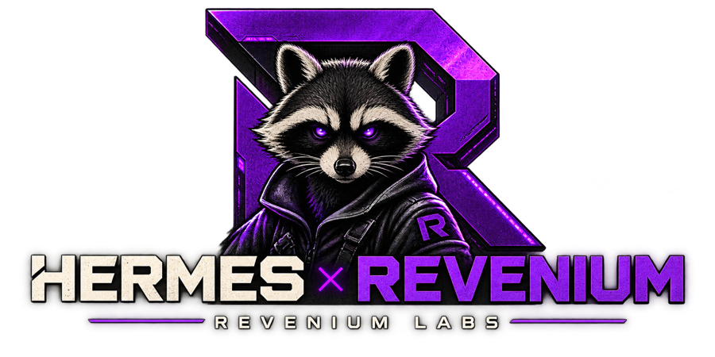

<div align="center">



# Hermes Revenium Skill

**Budget enforcement, semantic task-type metering, agentic job tracking, and tool-event
metering for [Hermes Agent](https://hermes-agent.nousresearch.com), on the
[Revenium](https://www.revenium.ai) platform.**


-f0a020?style=for-the-badge)

[Quick Start](#quick-start) ·
[Installation](#installation) ·
[Setup](#required-set-up-guardrails-cron-and-hooks) ·
[How it works](#how-it-works) ·
[Configuration](#configuration) ·
[Diagnostics](#status--diagnostics) ·
[Discord](https://discord.gg/J2DbmjZ2nA)

</div>

> ### 🧪 This is a Revenium Labs project
> **Revenium Labs** projects are field-developed, best-effort solutions. They are working,
> beta-quality software, built to solve real customer problems and shared in the open. They are
> **not** part of Revenium's officially supported products.
>
> - It works and solves a real problem, but may need adaptation to fit your exact environment.
> - It's provided as-is, without the versioned-release guarantees, SLAs, or formal support
>   that back our core products.
> - We welcome your issues, feedback, and PRs, and **we're happy to work with you** to make it
>   fit your use case. [Come talk to us on Discord](https://discord.gg/J2DbmjZ2nA).
>
> → **[What is Revenium Labs?](https://github.com/revenium/.github/blob/main/LABS.md)**

Every metered completion carries a meaningful `--task-type` drawn from a controlled vocabulary so Revenium analytics show *what the agent was doing* — not just an undifferentiated session total. Discrete task arcs are reported as Revenium agentic jobs with immutable once-only outcomes, and every Hermes tool call is metered via `revenium meter tool-event` — all while budget guardrails halt the agent structurally before it can overspend.

## Quick Start

1. **Install the skill and run setup:**

   ```bash
   hermes skills install revenium/hermes-revenium/skills/revenium
   bash ~/.hermes/skills/revenium/references/bootstrap.sh
   ```

   The first command installs the skill via Hermes' native install path. The scanner returns a `SAFE` verdict, so no `--force` is needed — see [What the security scanner reports](#what-the-security-scanner-reports) for the findings it does surface and why they are expected.

   > **Why the bootstrap?** `hermes skills install` does not ship a skill's whole directory. It ships `SKILL.md` plus only the support files `SKILL.md` names as bundle-relative paths, and only from an allowlist of directories — `references/`, `scripts/`, `templates/`, `assets/`, `examples/`. `plugins/` is not on that allowlist at all, so the classifier plugin can never arrive this way. `references/bootstrap.sh` is on the manifest, and it clones the repo, drops `scripts/` + `plugins/` into `~/.hermes/skills/revenium/`, and hands off to `scripts/install.sh`. If `references/bootstrap.sh` didn't come down either, clone and install directly instead: `git clone --depth 1 https://github.com/revenium/hermes-revenium.git /tmp/hermes-revenium && bash /tmp/hermes-revenium/install.sh`.

   **Updating an existing install?** Add `--update`: `bash ~/.hermes/skills/revenium/references/bootstrap.sh --update`. Without it the bootstrap sees a populated `scripts/` and skips the fetch, so a host that installed once keeps running the scripts it got that day. `--update` re-pulls and overlays, leaving any host-only scripts in place.

   The bootstrap then completes setup: walks your `revenium` CLI config (**api-url, API key, team-id, tenant-id, owner-id**), showing each current value as the default so you can confirm or correct it, installs the `revenium-classifier` plugin, registers the shell hooks, creates the guardrail budget rule, installs the per-minute metering cron, and restarts the Hermes gateway. It is **idempotent** — safe to re-run.

   Flags pass straight through to `install.sh`:
   - `--hard-limit 50 --period MONTHLY` — set the budget non-interactively (otherwise you're prompted).
   - `--all-profiles` / `--profile <name>` — wire a whole fleet of Hermes profiles (each profile gets its own plugin/hooks/cron and a distinct agent `Hermes-<profile>`). See [Multi-profile / fleet installs](#multi-profile--fleet-installs).
   - `--non-interactive` — take all four creds from `REVENIUM_API_KEY` / `REVENIUM_TEAM_ID` / `REVENIUM_TENANT_ID` / `REVENIUM_OWNER_ID` env vars (for automated/CI installs).
   - `--shadow-mode`, `--skip-guardrails`, `--skip-cron`, `--no-restart`, `--help`.

   > All four credentials matter: a config with only an API key meters completions fine but fails every guardrails/jobs create with `teamId is required`. The installer ensures all four are persisted.

2. **Approve hooks on first `hermes chat`** — Hermes shows an approval prompt the first time each hook fires.

> The installer is just an orchestrator over `install-plugin.sh`, `install-hooks.sh`, `setup-guardrails.sh`, and `install-cron.sh` — each is documented in full below if you want to run a step on its own.

## Prerequisites

- [Hermes Agent](https://hermes-agent.nousresearch.com/docs/) installed and running
- [Revenium](https://app.revenium.ai/connections) API key, Team ID, Tenant ID, and User ID
- [`revenium` CLI](https://github.com/revenium/revenium-cli) — `brew install revenium/tap/revenium`
- `sqlite3` and `python3` on `PATH`

Verify:

```bash
revenium config show
sqlite3 --version
python3 --version
```

## Installation

### Option 1: `hermes skills install` (recommended)

```bash
hermes skills install revenium/hermes-revenium/skills/revenium
bash ~/.hermes/skills/revenium/references/bootstrap.sh
```

The first command installs the skill via Hermes' native install path. That path ships `SKILL.md` plus only the support files `SKILL.md` names as bundle-relative paths — `references/bootstrap.sh` among them — and never `plugins/`, which Hermes disallows in a skill bundle outright. So the bootstrap fetches the missing `scripts/` + `plugins/` into `~/.hermes/skills/revenium/` and then completes setup — credentials, plugin, hooks, guardrail rule, cron, and gateway restart. See [Required: set up guardrails, cron, and hooks](#required-set-up-guardrails-cron-and-hooks) for what `install.sh` covers and the flags it accepts.

#### What the security scanner reports

The skill scans **`SAFE`** and installs without `--force`. Hermes still shows its
standard third-party disclaimer and asks you to confirm — that prompt applies to every
external skill, not to this one specifically.

The scan does surface `MEDIUM` findings. They are expected, and both categories describe
behaviour the skill genuinely has:

- **`persistence`** — `crontab` references in the cron scripts and setup docs. This is the
  load-bearing per-minute metering loop; it is intentional, fully disclosed, and cannot be
  removed without breaking the skill's core function.
- **`supply_chain`** — a `git clone` line in the documented install path.

An earlier `HIGH exfiltration` finding — the scanner reading `os.environ` in Python
heredocs as a potential credential dump — was cleared in v1.1 and no longer appears. Those
heredocs pass file paths and computed deltas, never credentials.

> Observed 2026-08-21 against scanner `skills-guard-v1` (rules `git_clone`,
> `persistence_cron`). The verdict is produced by Hermes' scanner, not by this repo, so it
> can change independently of anything here. If you get a `CAUTION` or `DANGEROUS` verdict,
> please [open an issue](https://github.com/revenium/hermes-revenium/issues) — that is a
> difference worth knowing about.

Review [`skills/revenium/scripts/`](skills/revenium/scripts/) before installing if you want
to verify the behaviour yourself.

### Option 2: Local development (for contributors)

Point Hermes at this repo's `skills/` directory:

```yaml
# ~/.hermes/config.yaml
skills:
  external_dirs:
    - /absolute/path/to/hermes-revenium/skills
```

Then restart Hermes or start a new session. External skill directories are read-only discovery sources; the local `~/.hermes/skills/` install wins on name collision.

### Option 3: Local copy

```bash
mkdir -p ~/.hermes/skills
cp -R skills/revenium ~/.hermes/skills/
```

Or use the bundled helper:

```bash
bash install.sh
```

### Option 4: Publish

To make this skill discoverable through Hermes' skill index:

```bash
hermes skills publish skills/revenium --to github --repo revenium/hermes-revenium
```

## Multi-profile / fleet installs

A Hermes [profile](https://github.com/revenium/hermes-revenium) is a separate Hermes home under `~/.hermes/profiles/<name>/` (the default profile uses `~/.hermes/` directly). To meter a fleet of profiles, add `--all-profiles` (or `--profile <name>`, repeatable) to the installer:

```bash
bash ~/.hermes/skills/revenium/scripts/install.sh --all-profiles
# or specific profiles:
bash ~/.hermes/skills/revenium/scripts/install.sh --profile gtm --profile qa
```

This wires plugin + hooks + cron once per profile home, each with:

- **A distinct AGENT** — `REVENIUM_AGENT_NAME` defaults to `Hermes-<profile>` (the default profile stays `Hermes`), so Revenium separates spend per agent. This is the **AGENT** dimension, *not* the ORGANIZATION dimension: `organizationName` is a company/product (e.g. `tableforone`) and is threaded through completions, tool-events, **and** `jobs create` so a job and its transactions share one org — never set it to an agent name. Set the org non-interactively with `--organization-name <name>` on `install.sh` (or `setup-guardrails.sh`); it's persisted to each profile's `config.json` even with `--skip-guardrails`.
- **A unique crontab marker** `# hermes-revenium-metering-<profile>` — a second profile install never clobbers the first. `uninstall-cron.sh` removes every profile's line; orphaned lines (after a `~/.hermes` reset) are reconciled automatically.
- **`hooks_auto_accept: true`** — headless profile gateways never show the hook-approval prompt, so hooks stay inert without this. Fleet installs set it automatically (`install-hooks.sh --auto-accept`). Use `install-hooks.sh --metering-only` to register only `post_tool_call` for shadow/metering-only profiles.
- **One shared SQUAD identity across the fleet (optional)** — set `REVENIUM_SQUAD_NAME` to group every profile's completions under one squad name, distinct from the per-profile AGENT. See [`references/setup.md`](skills/revenium/references/setup.md) → **Squad grouping across the fleet** for the resolution order and the fleet recipe.

Both deployment modes work: one-process-per-profile and the multiplexed single gateway (`gateway.multiplex_profiles: true`, where the classifier resolves the owning profile's home/state.db/markers **per session** from the `agent:<profile>:…` namespace). Size `REVENIUM_CRON_SETTLE_SECONDS` (default **600s**) above worst-case job-inference latency. See [`references/setup.md`](skills/revenium/references/setup.md) → **Multi-profile / fleet installs** for the full operational guide.

## Required: set up guardrails, cron, and hooks

**Option 1 (`hermes skills install` + `install.sh`) already ran this for you.** This section applies if you installed the skill another way (external_dirs, manual copy), or want to re-run/customize a step. Run the one-command installer:

```bash
bash ~/.hermes/skills/revenium/scripts/install.sh
```

It performs every step in this section in order — credentials, plugin, hooks, guardrail rule, cron, gateway restart — and is **idempotent** (already-configured steps are skipped on re-run). Flags: `--hard-limit N --period P` (non-interactive budget), `--non-interactive` (creds from `REVENIUM_*` env vars), `--shadow-mode`, `--skip-guardrails`, `--skip-cron`, `--no-restart`, `--help`.

If you'd rather run the steps yourself (or need to customize one), the individual scripts are documented below — `install.sh` is just an orchestrator over them.

### Credentials (all four required)

`install.sh` walks the whole `revenium` CLI config — **API URL, API key, Team ID, Tenant ID, and Owner ID** — on every interactive run, showing each current value in brackets as the default. Enter keeps it; typing replaces it; the result is persisted with `revenium config set`. Confirming rather than silently skipping is deliberate: an API URL left pointing at the wrong environment is invisible otherwise, and only shows up later as an opaque `HTTP 403` on guardrail-rule creation. All four ids matter: a config with only an API key meters completions fine but fails every `guardrails`/`jobs create` with `HTTP 400: teamId is required` — the API key alone is not enough. To set them manually:

```bash
revenium config show                         # check what's configured
revenium config set key       <API_KEY>
revenium config set team-id   <TEAM_ID>
revenium config set tenant-id <TENANT_ID>
revenium config set owner-id  <OWNER_ID>
```

### Set up guardrail budget rules

```bash
bash ~/.hermes/skills/revenium/scripts/setup-guardrails.sh --interactive
```

The script prompts for budget hard-limit, period, organization name, autonomous mode and notification channel/target, and optionally per-task-type rules. On success it creates Revenium guardrail budget rules and writes `ruleIds` into `~/.hermes/state/revenium/config.json`. Requires the four credentials above. Legacy `alertId` installs auto-migrate on the first cron tick — see [`docs/migration-guardrails.md`](docs/migration-guardrails.md).

### Install the per-minute metering cron

```bash
bash ~/.hermes/skills/revenium/scripts/install-cron.sh
```

The cron meters `~/.hermes/state.db` into Revenium and refreshes `~/.hermes/state/revenium/guardrail-status.json`. Hermes can't add crontab entries itself, so this step is manual. **Without it, the agent will tell you "Guardrail status not yet available" before every operation** — that's the skill correctly detecting the missing cron.

For demos or dashboards where the default 60-second cadence is too slow, install with a sub-minute interval. The cron still fires once per minute, but the pipeline loops inside each tick:

```bash
bash ~/.hermes/skills/revenium/scripts/install-cron.sh --interval-seconds 15
# 4× per minute (every 15s). Trade-off: 4× more revenium-CLI calls.

bash ~/.hermes/skills/revenium/scripts/install-cron.sh --interval-seconds 15 --force
# Replace an existing entry to change interval on a host that already has the cron.
```

Valid values: `1..60`. Use `--dry-run` to print the crontab line without installing.

### Install the Hermes shell hooks

```bash
bash ~/.hermes/skills/revenium/scripts/install-hooks.sh
```

The shell hooks register `pre_llm_call`, `pre_tool_call`, and `post_tool_call` handlers in `~/.hermes/config.yaml`. They are inert until you approve them on first `hermes chat`. Without the hooks, structural budget enforcement and tool-event capture are inactive.

### Install the classifier plugin

```bash
bash ~/.hermes/skills/revenium/scripts/install-plugin.sh
```

The script copies `revenium-classifier` into `~/.hermes/plugins/` and adds it to `plugins.enabled` in `~/.hermes/config.yaml`, then restarts the Hermes gateway so the change takes effect. Idempotent — re-run it safely after upgrading the skill. `hermes skills install` and `external_dirs` don't relocate the bundled `plugins/` subdirectory, so this step is what wires the classifier into Hermes' plugin discovery path. Without it, no `kind:"job"` markers are written — agentic-job usage never reaches Revenium even though completion metering still works. Pass `--dry-run` to preview, or `--no-restart` to skip the gateway restart.

To confirm the cron is running:

```bash
crontab -l | grep hermes-revenium-metering   # one entry
tail -f ~/.hermes/state/revenium/revenium-metering.log
```

## First-time setup

The guided Setup Flow is driven by `setup-guardrails.sh --interactive` (run for you by `install.sh`, invokable directly, or available at any time via `/revenium` inside a Hermes session). The skill detects that no `config.json` or `ruleIds` exists and automatically begins setup. Once configured, invoking `/revenium` instead offers status and reconfigure options. The script will:

1. Verify the `revenium` CLI already has all four credentials configured (API key, Team ID, Tenant ID, Owner ID). **`setup-guardrails.sh` does not prompt for credentials** — it only checks that a Team ID resolves, and exits with an error if not, since budget-rule creation fails without one. Credentials are set up by `install.sh` (which prompts for any that are missing) or manually with `revenium config set` (see [Credentials (all four required)](#credentials-all-four-required)). Run `revenium config show` to check what's configured.
2. Optionally ask for an organization name (for Revenium reporting attribution).
3. Ask for a budget hard-limit, warn threshold, and period (`DAILY`, `WEEKLY`, `MONTHLY`, `QUARTERLY`).
4. Ask whether the agent runs autonomously and, if so, which Hermes messaging channel should receive halt notifications.
5. Create a Revenium guardrail budget rule via `revenium guardrails budget-rules create` and write `ruleIds` into `~/.hermes/state/revenium/config.json`.

Setup is atomic — if any step fails, no partial config is written. The full step-by-step flow lives in [`skills/revenium/references/setup.md`](skills/revenium/references/setup.md).

## Upgrading on a remote host

Re-running `install.sh` **is** the upgrade — it is idempotent (already-configured steps are skipped, no duplicate rules or cron lines). Two things matter on every upgrade: get the new bytes onto the host, and re-sync the **plugin** (updating only `~/.hermes/skills/` leaves the active plugin at `~/.hermes/plugins/` stale). `install.sh` handles the plugin for you.

### Option A — host has the repo (or internet access)

```bash
ssh <host>
cd /path/to/hermes-revenium && git pull   # or: git clone https://github.com/revenium/hermes-revenium
bash install.sh                           # re-copies skill+plugin, re-runs hooks/cron/guardrails, restarts gateway
```

### Option B — push from your machine via rsync

```bash
# from the repo root locally
rsync -av --delete -e ssh skills/revenium/ <user>@<host>:~/.hermes/skills/revenium/

# then on the host, re-run the installer (skips creds already in 'revenium config show')
ssh <user>@<host> 'bash ~/.hermes/skills/revenium/scripts/install.sh'
```

> On hosts where `revenium`/`hermes` aren't on the bare login `PATH` (e.g. Linuxbrew installs), prefix the remote command: `PATH="/home/linuxbrew/.linuxbrew/bin:$HOME/.local/bin:$PATH" bash ~/.hermes/skills/revenium/scripts/install.sh`.

### Option C — native install path

```bash
ssh <host>
hermes skills install revenium/hermes-revenium/skills/revenium   # re-fetch the skill
bash ~/.hermes/skills/revenium/scripts/install.sh                        # complete setup
```

### After any upgrade

- If you copied only the skill (not via `install.sh`), run `bash ~/.hermes/skills/revenium/scripts/install-plugin.sh` so `~/.hermes/plugins/revenium-classifier/` gets the new version and the gateway restarts.
- **Don't leave `.bak` copies** of the skill under `~/.hermes/skills/` — plugin discovery scans their bundled `plugins/` dirs and a stale duplicate can shadow the real one.
- Verify: `bash ~/.hermes/skills/revenium/scripts/hooks-status.sh` and `crontab -l | grep hermes-revenium-metering`.

For non-interactive/CI upgrades, `install.sh --non-interactive` takes credentials from the `REVENIUM_API_KEY` / `REVENIUM_TEAM_ID` / `REVENIUM_TENANT_ID` / `REVENIUM_OWNER_ID` env vars.

## How it works

### Token metering with task-type classification

A background cron runs every minute and executes six stages under one lock —
`plugin-status.sh`, `hermes-report.sh`, `guardrail-check.sh`,
`tool-event-report.sh`, `api-event-report.sh`, and `drain-status.sh`. The token
reporter (`hermes-report.sh`): it reads token deltas from `~/.hermes/state.db`, then ships one `revenium meter completion` per marker. Each completion carries `--task-type` and `--operation-type` drawn from the task taxonomy, and job-owning markers also receive `--agentic-job-id`. Ledger lines are `HERMES:<session_id>:<total_tokens>:<unix_ts>:<muid>`, and a session is skipped when its `(sid, total_tokens)` pair is already present, so re-running the cron never double-reports.

Task-type and agentic-job inference is performed by the deterministic `revenium-classifier` plugin (`skills/revenium/plugins/revenium-classifier/`). It reads session data directly — it does not rely on the agent voluntarily classifying its own turns. Sessions with no markers fall back to `--task-type unclassified`.

The plugin registers **four** hooks, because no single one covers every session shape: `on_session_end`, `on_session_finalize`, `post_llm_call`, and `post_api_request`. `on_session_end` fires only from the session-expiry watcher, so gateway-served sessions would never be classified by it alone; `on_session_finalize` covers shutdown, expiry, and reset boundaries, and `post_llm_call` fires once per completed turn so an ordinary prompt produces a classified job on its **first** turn rather than waiting for a session boundary. A single guard (`_session_already_classified`) makes "exactly one classification per session" hold regardless of which hook fires first. `post_api_request` carries no classification concern at all — it is the event-metering seam described below.

### Event-driven metering (the v1.5 path)

Alongside the delta-based reporter above, a second path meters **each API call
individually**. The `post_api_request` hook fires once per call and appends a
compact record to a per-session spool — no network call, no LLM, no database
read on that path — and the cron's `api-event-report.sh` stage ships each record
as its own row, keyed on the provider's own `api_request_id`. Where
`hermes-report.sh` reports a session's token *delta* and divides it across that
session's markers, the event path reports what each call actually used.

**Two switches control it, and the difference between them is the thing to get
right:**

| Variable | Default | Effect |
|---|---|---|
| `REVENIUM_EVENT_METERING_MODE` | `shadow` | `shadow` computes rows without shipping; `live` ships them. |
| `REVENIUM_LEGACY_COMPLETIONS` | `enabled` | `enabled` keeps the delta reporter billing; `disabled` stands it down. |

**Setting `MODE=live` alone does not cut over.** With legacy still enabled, which
path bills a given session is decided by an ownership record, and the outcome
depends on a race you cannot predict from the switches — see
[`docs/event-metering.md`](docs/event-metering.md) for the mechanism and the
evidence behind it. A real cutover requires `REVENIUM_LEGACY_COMPLETIONS=disabled`.

Setting it fleet-wide is safe: profiles whose sessions have drained cut over
immediately, and the rest keep billing through the legacy path until they drain,
then cut over on their own. The `drain-status.sh` cron stage maintains that gate.
A session's effective stale threshold is
`max(REVENIUM_DRAIN_STALE_SECONDS, REVENIUM_CRON_SETTLE_SECONDS + 86400)`, and it
sets the floor on how fast a profile can converge. **Check yours before planning
a cutover — the default is not the fast case.** At the stock default
(`REVENIUM_DRAIN_STALE_SECONDS=604800`) a quiet open session takes **seven days**
to clear. Lowering it to `86400` puts the `settle + 86400` term on top, giving
`87000` seconds ≈ **24.17 hours** — the figure quoted in
[`docs/event-metering.md`](docs/event-metering.md), which reflects one fleet's
tuned configuration rather than the default.

Rollback is the reverse and is demonstrated, not assumed:
[`docs/rollback-rehearsal.md`](docs/rollback-rehearsal.md).

### Agentic job tracking

Discrete task arcs are reported as Revenium agentic jobs (`revenium jobs create` / `revenium jobs outcome`). Each arc's business outcome is recorded exactly once — outcomes are immutable and never re-sent. Idempotency is maintained in `~/.hermes/state/revenium/revenium-jobs.ledger`. AI transactions belonging to a job are linked in Revenium via `--agentic-job-id`.

Every job outcome also carries a `--metadata` JSON blob: the deployment `source` (from the session's source column) on every outcome, plus a `failure_reason` on `FAILED` arcs — a brief plain-text cause inferred by the classifier. `SUCCESS` and `CANCELLED` arcs carry source only.

### Tool-event metering

The `post_tool_call` hook captures each Hermes tool call (tool name, duration in milliseconds, success/failure, `tool_call_id`, session ID, error message) to a per-session file at `~/.hermes/state/revenium/tool-events/<sid>.jsonl`. The hook makes no network call — it is a pure local observer that exits 0 on any internal failure so it never blocks the agent. The cron's `tool-event-report.sh` stage then reads these files and ships each unledgered record via `revenium meter tool-event`, keyed on `<sid>:<tool_call_id>` in `revenium-tool-events.ledger`.

### Guardrail enforcement

Guardrail enforcement is **structural**: the `pre_llm_call` and `pre_tool_call` Hermes shell hooks check `guardrail-status.json` on every turn and act per the warn/block band, blocking the agent deterministically regardless of session length. The `SKILL.md` halt block is a procedural backstop — the hooks are the load-bearing enforcement path.

Before every operation the agent's state resolves to one of:

- **All rules ok** → proceed silently.
- **Warn-band rule active** → `pre_llm_call` emits one stderr line per (session, ruleId) and the agent continues.
- **Block-band rule active, autonomous mode** → `pre_tool_call` blocks all tool calls and emits an `action: block` response; `pre_llm_call` injects the verbatim halt directive into the turn. A notification (including the most recent enforcement-events list entry) is sent through the configured Hermes messaging channel.
- **Status file missing** → proceed with caution (fail-open).

The three shell hooks are registered by `install-hooks.sh` and removed by `uninstall-hooks.sh`. They are inert until the user approves them on first `hermes chat`. `guardrail-check.sh` (the second cron stage) refreshes `guardrail-status.json` and detects new halt transitions; on transition into halt, it embeds the latest enforcement-event into the halt notification.

The full halt/exceed contract — including the exact halt response string the agent must emit verbatim — is specified in [`skills/revenium/SKILL.md`](skills/revenium/SKILL.md).

### `/revenium` command

Run `/revenium` at any time inside a Hermes session to:

- **View budget status** — current spend, threshold, percent used, halt state.
- **Reset** — recreate the budget rule with the same settings (zeroes current spend).
- **Reconfigure** — update API key, budget amount, or period (deletes the old budget rule and creates a new one).

## Configuration

The skill stores its config at `~/.hermes/state/revenium/config.json`:

```json
{
  "ruleIds": ["d5jng5"],
  "organizationName": "my-org",
  "autonomousMode": false,
  "notifyChannel": "slack",
  "notifyTarget": "channel:C0123456789"
}
```

| Field               | Required | Purpose                                                                          |
| ------------------- | -------- | -------------------------------------------------------------------------------- |
| `ruleIds`           | yes      | Array of `revenium guardrails budget-rules` ruleIds owned by this install. Populated by `setup-guardrails.sh` and on first cron tick for legacy-upgrade installs. |
| `organizationName`  | no       | Used as `--organization-name` on metered transactions for Revenium attribution.  |
| `autonomousMode`    | no       | When `true`, a blocked guardrail rule halts the agent and sends a notification.  |
| `notifyChannel`     | autonomous only | Hermes messaging channel for halt notifications (e.g. `slack`, `discord`). |
| `notifyTarget`      | autonomous only | Channel-specific target (e.g. `channel:<id>`, `user:<id>`, `@username`).   |

> Legacy `alertId` field is preserved on upgraded hosts but no longer used — see [`docs/migration-guardrails.md`](docs/migration-guardrails.md).

Your Revenium credentials (API key, Team ID, Tenant ID, Owner ID) live separately at `~/.config/revenium/config.yaml`, written by `revenium config set`. The skill never reads or writes that file directly.

## Manual commands

```bash
# Run metering + guardrail check + tool-event reporting once
bash ~/.hermes/skills/revenium/scripts/cron.sh

# Run only the SQLite reporter (completion metering with task-type)
bash ~/.hermes/skills/revenium/scripts/hermes-report.sh

# Run only the guardrail check
bash ~/.hermes/skills/revenium/scripts/guardrail-check.sh

# Run only the tool-event reporter
bash ~/.hermes/skills/revenium/scripts/tool-event-report.sh

# Clear an active halt
bash ~/.hermes/skills/revenium/scripts/clear-halt.sh

# Prune stale marker files (30+ days old by default; --dry-run to preview)
bash ~/.hermes/skills/revenium/scripts/prune-markers.sh

# (Re)install the per-minute cron entry
bash ~/.hermes/skills/revenium/scripts/install-cron.sh

# Remove the cron entry
bash ~/.hermes/skills/revenium/scripts/uninstall-cron.sh

# Register the pre_llm_call / pre_tool_call / post_tool_call hooks
bash ~/.hermes/skills/revenium/scripts/install-hooks.sh

# Remove the shell hooks
bash ~/.hermes/skills/revenium/scripts/uninstall-hooks.sh

# Install the revenium-classifier plugin into ~/.hermes/plugins/
bash ~/.hermes/skills/revenium/scripts/install-plugin.sh

# Diagnose whether the hooks are registered AND firing
bash ~/.hermes/skills/revenium/scripts/hooks-status.sh
```

## Status & diagnostics

```bash
# Tail the metering log
tail -f ~/.hermes/state/revenium/revenium-metering.log

# Inspect the live guardrail snapshot
cat ~/.hermes/state/revenium/guardrail-status.json

# Confirm the cron is installed
crontab -l | grep hermes-revenium-metering

# Inspect the completion idempotency ledger
tail -n 20 ~/.hermes/state/revenium/revenium-hermes.ledger

# Inspect the agentic-job idempotency ledger
tail -n 20 ~/.hermes/state/revenium/revenium-jobs.ledger

# Inspect the tool-event idempotency ledger
tail -n 20 ~/.hermes/state/revenium/revenium-tool-events.ledger

# Inspect captured tool-event records for a session
cat ~/.hermes/state/revenium/tool-events/<sid>.jsonl

# Run the end-to-end hooks diagnostic — registration + approval mode + recent
# capture activity + state.db cross-check. Stable exit codes for scripting:
# 0 = hooks firing, 1 = not registered, 2 = registered but inert.
bash ~/.hermes/skills/revenium/scripts/hooks-status.sh
```

If `guardrail-status.json` does not exist, the cron has not run yet — run `cron.sh` once manually to seed it. If `tool-events/` stays empty even though Hermes is running tools, run `hooks-status.sh` first — the most common cause is the hooks being registered but not yet approved on `hermes chat`. More failure modes are documented in [`skills/revenium/references/troubleshooting.md`](skills/revenium/references/troubleshooting.md).

## Verification

Run these in order to confirm a successful install:

```bash
crontab -l | grep hermes-revenium-metering         # one entry
grep hermes-revenium-hooks ~/.hermes/config.yaml   # 3 hook commands registered
grep post_tool_call ~/.hermes/config.yaml          # post_tool_call hook present
jq '.ruleIds' ~/.hermes/state/revenium/config.json # non-empty array
```

Wait one cron tick (≤60s), then:

```bash
cat ~/.hermes/state/revenium/guardrail-status.json  # expect rules[] populated
```

When a guardrail block-band rule fires under autonomous mode, the agent emits the verbatim halt directive:

```
Guardrail halt active — rule '[name]' ([metricType], [windowType]) at [currentValue] of [hardLimit] hard-limit. To resume: `bash ~/.hermes/skills/revenium/scripts/clear-halt.sh`
```

(D-01 verbatim halt string — values substituted from `guardrail-status.json::haltedRule`.)

## Uninstalling

```bash
bash ~/.hermes/skills/revenium/scripts/uninstall-cron.sh
bash ~/.hermes/skills/revenium/scripts/uninstall-hooks.sh
rm -rf ~/.hermes/skills/revenium ~/.hermes/state/revenium
```

Optionally clean up the Revenium-side guardrail rules:

```bash
revenium guardrails budget-rules list
revenium guardrails budget-rules delete <rule-id> --yes
```

## Testing

The repo ships stdlib `unittest` smoke checks covering expected files, frontmatter shape, runtime path conventions, and shell-script syntax:

```bash
python3 -m unittest discover -s tests -p 'test_*.py' -v
```

Beyond the automated smoke checks, a manual halt-check survivability test plan — operator runbook is documented at `skills/revenium/references/halt-survivability.md`. Run it before any release that modifies the `SKILL.md` halt block to confirm the halt-check anchor still fires correctly under context dilution in long sessions.

## Notes

- This repo is Hermes-only and intentionally clean — no legacy runtime assumptions from the source skill it was forked from.
- The skill is packaged at `skills/revenium/` so the default `hermes skills tap add owner/repo` discovery path resolves it without extra configuration.
- Mutable runtime state lives under `~/.hermes/state/revenium/`. Skill content lives under `~/.hermes/skills/revenium/`. Don't mix the two.

## Support

Questions, bugs, or feature requests? Join us on [Discord](http://discord.gg/J2DbmjZ2nA).
