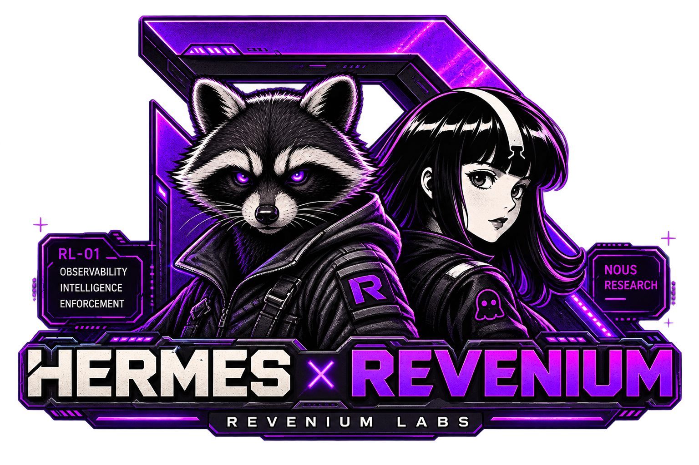

<div align="center">



# Hermes Revenium

**Budget enforcement, semantic task-type metering, agentic job tracking, and tool-event
metering for [Hermes Agent](https://hermes-agent.nousresearch.com), on the
[Revenium](https://www.revenium.ai) platform. Ships as a Hermes skill bundle; the work is
done by a plugin, three shell hooks, and a cron.**


-f0a020?style=for-the-badge)

[](https://github.com/revenium/hermes-revenium/actions/workflows/tests.yml)
[](https://github.com/revenium/hermes-revenium/actions/workflows/secret-scan.yml)

[Quick start](#quick-start) ·
[Install](docs/installation.md) ·
[How it works](docs/how-it-works.md) ·
[Fleet](docs/fleet.md) ·
[Operations](docs/operations.md) ·
[Docs](docs/README.md) ·
[Discord](https://discord.gg/J2DbmjZ2nA)

</div>

> ### 🧪 This is a Revenium Labs project
> **Revenium Labs** projects are field-developed, best-effort solutions. They are working,
> beta-quality software, built to solve real customer problems and shared in the open. They are
> **not** part of Revenium's officially supported products.
>
> - It works and solves a real problem, but may need adaptation to fit your exact environment.
> - It's provided as-is, without the versioned-release guarantees, SLAs, or formal support
>   that back our core products.
> - We welcome your issues, feedback, and PRs, and **we're happy to work with you** to make it
>   fit your use case. [Come talk to us on Discord](https://discord.gg/J2DbmjZ2nA).
>
> → **[What is Revenium Labs?](https://github.com/revenium/.github/blob/main/LABS.md)**

Hermes reports token totals per session. That tells you what you spent and nothing about
what you bought. This closes that gap: every metered completion is labelled with what the
agent was actually doing, each task arc is tracked as a billable job, every tool call is
metered, and the agent is halted structurally when a budget rule blocks.

## What you get

| | |
|---|---|
| **Semantic task types** | Every completion ships with `--task-type` and `--operation-type` from a controlled vocabulary, inferred by a plugin that reads the session transcript — not by asking the agent to label itself. |
| **Agentic job tracking** | Discrete task arcs become Revenium jobs with immutable, once-only outcomes, and their transactions are linked back via `--agentic-job-id`. |
| **Tool-event metering** | Every Hermes tool call is metered — name, duration, success, error — through `revenium meter tool-event`. |
| **Structural budget guardrails** | Hermes shell hooks read a local guardrail snapshot before every LLM call and every tool call, so enforcement does not depend on the agent choosing to comply. |

## What's actually installed

"Skill" is how this is packaged and installed, not what does the work. Four pieces land on
the host, and only one of them is the skill:

| Piece | What Hermes calls it | Where it lives | What it does |
|---|---|---|---|
| `revenium-classifier` | **plugin** — Python, `register(ctx)`, four lifecycle hooks | `~/.hermes/plugins/` | All classification, and the per-API-call event spool |
| `pre_llm_call`, `pre_tool_call`, `post_tool_call` | **shell hooks** registered in `config.yaml` | `~/.hermes/skills/revenium/scripts/` | All budget enforcement, and tool-call capture |
| `cron.sh` and its six stages | **cron job**, out of process | `~/.hermes/skills/revenium/scripts/` | Everything that talks to the Revenium API |
| `SKILL.md` | **skill** — markdown loaded into the agent's context | `~/.hermes/skills/revenium/` | A halt-check backstop, by its own description defense-in-depth only |

This matters operationally. Hermes loads plugins from `~/.hermes/plugins/` and skills from
`~/.hermes/skills/` — different roots, different loaders — and `hermes skills install`
carries only the second. That is why installing the skill is not enough on its own, and why
the bootstrap exists. It is also why a stale plugin copy is the most common silent failure
on a multi-profile host: the skill tree is shared, the plugin is not.

## Quick start

```bash
hermes skills install revenium/hermes-revenium/skills/revenium
bash ~/.hermes/skills/revenium/references/bootstrap.sh
```

The first command installs the skill through Hermes' native path; it scans `SAFE`, so no
`--force` is needed. The second one fetches the parts that path cannot carry — `scripts/`
and `plugins/` — and then completes setup: credentials, classifier plugin, shell hooks,
guardrail budget rule, per-minute cron, gateway restart. It is idempotent, so re-running it
is always safe.

Then start a Hermes session and **approve the hooks** at the prompt Hermes shows the first
time each one fires. Until you do, they are registered but inert.

> **Running more than one Hermes profile?** Add `--profile <name>` (repeatable) or
> `--all-profiles`. Every command here is scoped to **one** Hermes home, and the default
> home is not a superset of the others — a profile you never name gets no plugin, no hooks,
> no cron, and meters nothing. See [Multi-profile / fleet installs](docs/fleet.md).

Full instructions, the other three install paths, and what the security scanner reports:
**[docs/installation.md](docs/installation.md)**.

## Prerequisites

- [Hermes Agent](https://hermes-agent.nousresearch.com/docs/) installed and running
- [Revenium](https://app.revenium.ai/connections) API key, Team ID, Tenant ID, and User ID
- [`revenium` CLI](https://github.com/revenium/revenium-cli) — `brew install revenium/tap/revenium`
- `sqlite3` and `python3` on `PATH`

```bash
revenium config show
sqlite3 --version
python3 --version
```

## Documentation

| Guide | What it covers |
|---|---|
| [Installation](docs/installation.md) | Four install paths, credentials, guardrail rules, cron, hooks, plugin, and how to verify the result |
| [How it works](docs/how-it-works.md) | The classification pipeline, both metering paths, agentic jobs, tool events, and guardrail enforcement |
| [Configuration](docs/configuration.md) | `config.json` fields, credential storage, and the two event-metering switches |
| [Multi-profile / fleet](docs/fleet.md) | Per-profile installs and the footguns that cost real time on a live fleet |
| [Upgrading](docs/upgrading.md) | Four upgrade paths and what must be re-run after each |
| [Operations](docs/operations.md) | Manual commands, diagnostics, uninstall, and the test suite |
| [Event metering](docs/event-metering.md) | The v1.5 event path in depth: mechanism, cutover, and rollback |
| [Migrations](docs/migration-guardrails.md) | [Guardrails](docs/migration-guardrails.md) · [AGENT dimension](docs/migration-agent-dimension.md) |

Reference material that ships inside the skill bundle lives at
[`skills/revenium/references/`](skills/revenium/references/) —
[setup](skills/revenium/references/setup.md),
[troubleshooting](skills/revenium/references/troubleshooting.md),
[task taxonomy](skills/revenium/references/task-taxonomy.md), and the
[config schema](skills/revenium/references/config-schema.md).


## Notes

- The skill is packaged at `skills/revenium/` so the default `hermes skills tap add owner/repo`
  discovery path resolves it without extra configuration.
- Mutable runtime state lives under `~/.hermes/state/revenium/`; skill content lives under
  `~/.hermes/skills/revenium/`. Don't mix the two.
- This repo is Hermes-only by design — no legacy runtime assumptions carried over from the
  skill it was forked from.

## Contributing

Issues and PRs are welcome — see [CONTRIBUTING.md](CONTRIBUTING.md) for how the repo is
laid out, the invariants the test suite enforces, and what to run before opening a PR.

## Changelog

Release history is in [CHANGELOG.md](CHANGELOG.md).

## License

[MIT](LICENSE) — the same license as [Hermes Agent](https://github.com/NousResearch/hermes-agent)
itself, and the one `skills/revenium/SKILL.md` already declares in its frontmatter.

## Support

Questions, bugs, or feature requests? Join us on [Discord](http://discord.gg/J2DbmjZ2nA).
