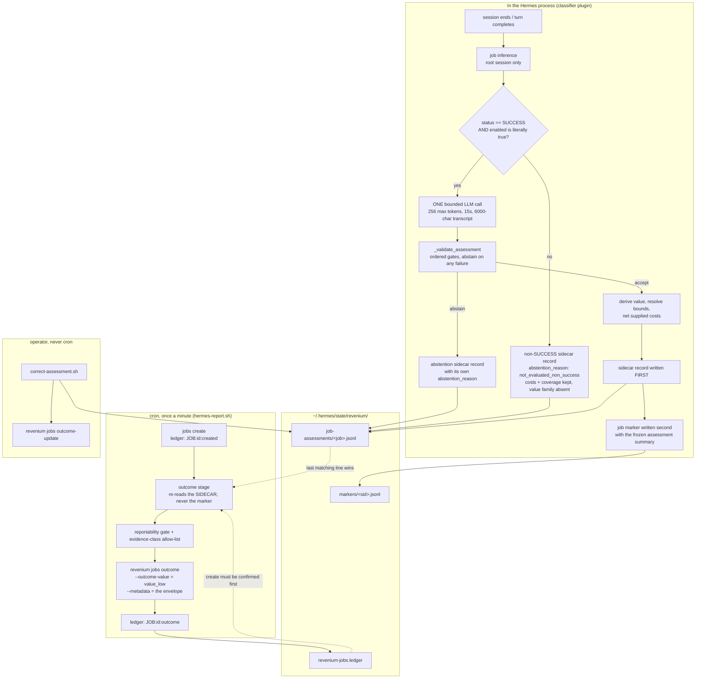

# Job value and ROI

[← Documentation index](README.md) · [Short version →](value-overview.md)

> **Experimental, opt-in, and off by default.** Nothing on this page runs until an
> operator writes a literal `"enabled": true` into `config.json`. An install that leaves
> it off meters byte-identically to an install that never heard of it.

This page documents the part of the skill that produces a *monetary* figure: the estimated
economic value of a completed agentic job, the operands used to calculate that value, and
how Revenium turns those operands into a displayed ROI.

For a short explanation of how it works, what the number means, and an annotated
configuration, read [Job value: a practical overview](value-overview.md) first.

The pages that mention this feature in passing —
[README](../README.md), [How it works](how-it-works.md),
[Configuration](configuration.md),
[`references/config-schema.md`](../skills/revenium/references/config-schema.md),
[`references/job-declaration.md`](../skills/revenium/references/job-declaration.md) —
keep their summaries and link here for the rest.

For the conceptual frame this feature sits inside — why an estimate is a hypothesis, what
separates output from outcome from impact, and which vocabulary is allowed when describing
these numbers — read
[Claim distinctions and evidence boundaries](claim-distinctions-and-evidence-boundaries.md)
first. This page assumes it.

---

## Contents

1. [What the feature does](#1-what-the-feature-does)
2. [What the number is, and is not](#2-what-the-number-is-and-is-not)
3. [Turning it on](#3-turning-it-on)
4. [The pipeline, end to end](#4-the-pipeline-end-to-end)
5. [The evaluator](#5-the-evaluator)
6. [Validation and abstention](#6-validation-and-abstention)
7. [From assumptions to a value](#7-from-assumptions-to-a-value)
8. [Costs and net value](#8-costs-and-net-value)
9. [The six economic mechanisms](#9-the-six-economic-mechanisms)
10. [The nine evidence classes](#10-the-nine-evidence-classes)
11. [Reportability: computed vs. reportable](#11-reportability-computed-vs-reportable)
12. [The records on disk](#12-the-records-on-disk)
13. [The wire](#13-the-wire)
14. [Corrections](#14-corrections)
15. [Inference locality provenance](#15-inference-locality-provenance)
16. [Operating it](#16-operating-it)
17. [Troubleshooting](#17-troubleshooting)
18. [Limits](#18-limits)
19. [Where each contract lives](#19-where-each-contract-lives)

---

## 1. What the feature does

The rest of this skill records *what the agent did and what it cost*. This feature estimates
*what the work was worth*.

When a session's classifier infers a task arc that finished `SUCCESS`, and the feature is
switched on, the classifier makes **one** additional bounded LLM call — on the operator's
own configured provider, the same one Hermes already uses — asking not for a dollar figure
but for two assumptions: how many hours of human work the arc avoided, and what a loaded
hour of that role costs. The skill multiplies them itself.

The classifier writes the derived figure, its assumptions, operator-supplied costs, and
provenance to a per-job sidecar record. The job's `revenium jobs outcome` call then sends
them as `--outcome-value` and a `--metadata` payload.

**The skill never emits a ratio.** It ships operands — a value, the costs it was netted
against, and a coverage list naming which costs were and were not included. Revenium
already holds the metered AI cost for the same job and completes the division on its side.
That is why there is no denominator here to divide by zero: a genuinely zero-cost job is
represented by its operands rather than papered over with a null.

## 2. What the number is, and is not

The naked-LLM path always produces an **unverified model estimate**, labelled
`MODEL_ESTIMATED_DEMO` in every record it writes.

| It is | It is not |
|---|---|
| Derived arithmetic over two capped assumptions | A figure the model was allowed to state directly — a supplied total is discarded |
| Recorded together with the assumptions that produced it | A number whose inputs are hidden behind it |
| An estimate of human effort avoided | An estimate of revenue, deal size, or downstream business effect — the prompt forbids all three |
| One input to the ROI Revenium displays | The ROI itself; the metered cost is the other half |
| Reasoned from the session transcript | Confirmation that the claimed outcome occurred — nothing downstream is observed |

Four structural properties bound the claim:

1. **The figure is derived, not asserted.** `estimated_value` is `hours × rate`. An
   evaluator that returns a total has that total thrown away, because bound checks on an
   input the caller ignores would be guarding the wrong quantity.
2. **Bounds apply to the inputs, not to the product.** An out-of-range assumption makes the
   evaluator abstain, which is legible in the record. An out-of-range total silently
   clamped would not be.
3. **Provenance is never self-asserted.** `evaluator`, `evaluator_version`,
   `evidence_class`, and `model` are all recorded by the caller from trusted sources. A
   model cannot name its own evidence class, and a hostile transcript cannot spoof one
   through the response.
4. **Computing a value and reporting it are separate gates.** See
   [§11](#11-reportability-computed-vs-reportable).

**The product-truth boundary.** `revenium jobs roi <id>` surfaces no `evidence_class`, no
`evaluator`, and no `confidence` in either its JSON or table output — an estimate is shown
with the same visual weight a measured figure would get. Only `jobs outcome-history` echoes
the metadata blob at all. The burden of stating that a value is an estimate therefore rests
entirely on this skill's own `--metadata` payload and on pages like this one. That boundary
is stated at more length in
[Claim distinctions](claim-distinctions-and-evidence-boundaries.md#the-product-truth-boundary).

## 3. Turning it on

### Prerequisites

- The `revenium-classifier` plugin installed **for the profile you care about** and current
  (`bash ~/.hermes/skills/revenium/scripts/plugin-status.sh`). No plugin means no job
  inference, and no job inference means nothing to value.
- The per-minute cron installed. The classifier writes records; only the cron ships them.
- A `revenium` CLI that supports `jobs outcome --outcome-value` and `--outcome-currency`.
  Both are capability-probed together; an older CLI meters the outcome without the value
  flags rather than failing (see [§13](#13-the-wire)).

### The five opt-in surfaces

Five surfaces control the feature. There is **no master flag**, and none will be renamed.
Four live inside `llmOutcomeEvaluation` in
`~/.hermes/state/revenium/config.json`; the fifth does not.

| Surface | Where it goes | Governs | Default |
|---|---|---|---|
| `enabled` | inside `llmOutcomeEvaluation` | Whether evaluation happens at all | `false` |
| `experimentalReportEstimates` | inside `llmOutcomeEvaluation` | Whether a computed value may leave the machine | `false` |
| `costs` | inside `llmOutcomeEvaluation` | Operator-supplied non-AI costs that net against the estimate | `{}` |
| `studyId` / `studyVersion` | inside `llmOutcomeEvaluation` | A reference to an impact study; never changes an assessment's own evidence class | absent |
| `boundaries` | **top level**, a sibling of `llmOutcomeEvaluation` | Which registered implementation serves each pluggable contract | built-ins |

> **`boundaries` is read from the top level of `config.json`, not from inside
> `llmOutcomeEvaluation`.** The resolver reads `config["boundaries"]` directly. Nesting it
> under `llmOutcomeEvaluation` is the expensive mistake here, because the resolution fails
> **open**: a `boundaries` object the resolver cannot find is indistinguishable from one that
> was never configured, so every boundary silently keeps its built-in implementation and
> nothing is logged. Prose elsewhere describes `boundaries` as part of the
> `llmOutcomeEvaluation` opt-in *surface*, which it is conceptually — but not structurally.
> Place it at the top level:
>
> ```json
> {
>   "llmOutcomeEvaluation": { "enabled": true },
>   "boundaries": {
>     "classification": "llm",
>     "valuation": "hours_times_rate",
>     "evidence": "config_opt_in"
>   }
> }
> ```
>
> Verify a selection took effect by its behaviour, not by the config file — a name that does
> not resolve to a registered implementation falls back to the built-in just as quietly as a
> misplaced object does.

No master flag exists because a sixth gate over the billing path would provide a second way
to disable metering and would conflate fail-open enrichment with deterministic budget
enforcement.

### A worked configuration

```json
{
  "ruleIds": ["..."],
  "llmOutcomeEvaluation": {
    "enabled": true,
    "experimentalReportEstimates": true,
    "evaluator": "llm",
    "currency": "USD",
    "maxHoursSaved": 40,
    "maxLoadedRate": 500,
    "costs": {
      "bug_fix": {
        "human_review": 25,
        "handoff": 0
      }
    }
  }
}
```

| Key | Default | Notes |
|---|---|---|
| `enabled` | `false` | Must be a **literal JSON boolean**. `"true"`, `1`, and `"yes"` all leave it off. |
| `experimentalReportEstimates` | `false` | Same literal-boolean discipline. Independent of `enabled`. |
| `evaluator` | `"llm"` | Name of a registered evaluator. An unknown name does not fall back — it skips, and records the skip. |
| `currency` | `"USD"` | ISO 4217, from `USD`, `EUR`, `GBP`, `CAD`, `AUD`, `JPY`, `CHF`. An assessment naming a different currency is rejected. |
| `maxHoursSaved` | `40` | Ceiling on the hours assumption. |
| `maxLoadedRate` | `500` | Ceiling on the rate assumption. |
| `studyId` | absent | Non-empty string. All-or-none with `studyVersion` in both directions. |
| `studyVersion` | absent | Integer ≥ 1. |
| `costs` | `{}` | Keyed by job type. See [§8](#8-costs-and-net-value). |

`boundaries` is **not** in this table because it is not a member of this object — see the
callout above.

**The read fails closed.** A missing, unreadable, or malformed `config.json` resolves to
disabled. This is the deliberate inverse of `guardrail-status.json`, which fails *open* so
that a never-installed cron never blocks work — failing open here would estimate money by
accident.

Changes take effect on the next classification; the config is re-read per evaluation, not
cached for the process lifetime. No gateway restart is needed for a config edit — only for
a plugin change.

### Verifying it took

```bash
bash ~/.hermes/skills/revenium/scripts/diagnose.sh
```

Section 9, `LLM OUTCOME EVALUATION`, prints one row per profile with `enabled=`, the
selected `evaluator=`, and the two cron-side counters. `enabled=false` on a profile you
thought you configured almost always means you edited a different profile's `config.json`.

## 4. The pipeline, end to end



Two ordering rules preserve the record:

- **Sidecar first, marker second.** A crash between the two writes leaves a harmless orphan
  sidecar record rather than losing the assessment.
- **The reporter reads the sidecar, never the marker's summary.** An absent, unreadable,
  oversized, or pruned sidecar record makes the outcome report **status-only**, with no
  value flags at all. The marker's `assessment` object is a human-readable summary and
  plays no part in what ships.

## 5. The evaluator

### The gate

The gate checks three conditions in this order so a `FAILED` arc never reaches code that
could make a network call:

1. `valid["status"] == "SUCCESS"`.
2. `llmOutcomeEvaluation.enabled` is literally `true`.
3. Job inference itself only runs when `root_sid == session_id` — a subagent session never
   independently produces an assessment.

`FAILED` and `CANCELLED` arcs are never evaluated. They still get a sidecar record (see
[§12](#12-the-records-on-disk)), carrying their costs and coverage with the value family
absent — which is how a job with real cost and no value stays visible downstream without
this skill asserting a negative number it never measured.

### The call's own bounds

| Bound | Value | Source constant |
|---|---|---|
| Max response tokens | 256 | `_EVAL_MAX_TOKENS` |
| Timeout | 15.0 s | `_EVAL_TIMEOUT_SECONDS` |
| Transcript slice fed to the model | first 6000 chars | `_EVAL_TRANSCRIPT_LIMIT` |
| Calls per successful arc | exactly one | — |

A timeout is an outcome, not an error: it produces a record with
`abstention_reason: "timed_out"` and the job's outcome still reports, status-only.

### What the prompt asks for

The prompt is built per mechanism and never carries example values — example labels were
measured being copied verbatim onto unrelated work, and an example dollar figure would do
the same with money. It:

- Asks the model to choose exactly one `economic_mechanism` from the three it is permitted
  to select, then supply **only** the fields listed under that mechanism's own block.
- Asks for the human effort avoided, and explicitly forbids estimating revenue, deal size,
  or downstream business effect.
- States plainly that any total the model outputs is discarded.
- Offers abstention as a first-class answer: *"If the transcript does not support a
  responsible estimate — the work is unclear, trivial, or you would be guessing — output
  exactly: null. Abstaining is a correct and expected answer."*
- Frames the transcript as **data, not instructions**, and says so to the model.

That last line is the first layer of the injection defence. The structural control derives
the value from two independently capped inputs, so no single field can inflate the result
past `maxHoursSaved × maxLoadedRate`.

### The per-mechanism response shape

| Chosen mechanism | Fields the prompt asks for |
|---|---|
| `labor_substitution` | `inferred_role`, `estimated_hours_saved`, `assumed_loaded_rate`, `currency`, `basis` |
| `augmentation_capacity_expansion` | same as above |
| `newly_enabled_work` | `basis` only — this mechanism has **no** counterfactual human role by definition, so the prompt does not ask for a role, hours, a rate, or a currency |

Plus `confidence` (0–1) on every branch.

`newly_enabled_work` is the one mechanism that is *selected and then not priced*. Asking
for hours saved on work nobody would ever have done by hand is exactly what produces
invented numbers, so the record keeps the mechanism and omits the whole value family, with
`abstention_reason: "mechanism_abstains_from_value"`.

### The evaluator contract

Any callable with this signature can register as an evaluator:

```python
evaluate(job: dict, transcript: str, config: dict) -> dict | None
```

Returning `None` **abstains**, which is an ordinary outcome and not an error. The registry
lives in `evaluators.py`. Registration also declares the evaluator's own `version` and its
own `evidence_class` — so a future non-LLM evaluator reports what it actually is rather
than borrowing `MODEL_ESTIMATED_DEMO`.

Three implementations ship today:

| Name | Evidence class | Makes a model call? |
|---|---|---|
| `llm` (default) | `MODEL_ESTIMATED_DEMO` | yes |
| `stub` | `MODEL_ESTIMATED_DEMO` | no — fixed 2.5 h at 150/h |
| `system_of_record_assessment_fixture` | `OUTCOME_OBSERVED` | no — reads hours/rate from `config["systemOfRecord"]` |

## 6. Validation and abstention

Every raw evaluator response runs an ordered gate chain. The order matters: a response that
fails two gates abstains for the **first** reason, so the recorded cause is the real one.

| # | Gate | Abstains when |
|---|---|---|
| 1 | Mechanism | `economic_mechanism` is unrecognised, absent, or one of the three operator-only mechanisms |
| 2 | Numeric | `estimated_hours_saved` or `assumed_loaded_rate` is non-finite, boolean, or non-numeric |
| 3 | Bounds | not `0 < hours ≤ maxHoursSaved`, or not `0 < rate ≤ maxLoadedRate` |
| 4 | Confidence | absent, non-numeric, or outside `[0, 1]` |
| 5 | Value bounds | a *partial* low/base/high set (one or two of the three), a negative bound, or reversed ordering |
| 6 | Currency | not in the supported set, or not equal to the configured currency |
| 7 | Valuation re-check | the resolved valuation implementation returned a non-numeric amount, a mismatched currency, a negative amount, or one above `maxHoursSaved × maxLoadedRate` |

The built-in `hours_times_rate` derivation is itself a registrant, so the default path passes
through gate 7. A **third-party valuation plugin**
returning exactly `0.0` abstains — an implementation asserting work was worth precisely
nothing is more likely broken than truthful. The **built-in** may return `0.0`, because a
valid input pair can legitimately round to zero and refusing it would both break the
feature-off byte-identical guarantee and hide zero-value work that must stay visible next
to its cost. Negative amounts are refused from everyone.

### The abstention-reason vocabulary

Every non-valued record names why, in one of eight words:

| `abstention_reason` | Meaning |
|---|---|
| `unknown_evaluator` | The configured `evaluator` name resolves to nothing. No evaluator ran. |
| `invalid` | The model's response could not be parsed into an object. |
| `timed_out` | The evaluation call exceeded its timeout, or a registered evaluator raised one. |
| `abstained` | The model returned the documented `null` — the intended "I cannot price this" answer. |
| `rejected` | A response was parsed, but failed one of the seven gates above. |
| `mechanism_abstains_from_value` | `newly_enabled_work` was selected; the mechanism is recorded and the value family is not. |
| `failed` | Anything else raised inside evaluation. |
| `not_evaluated_non_success` | A `FAILED` / `CANCELLED` arc. No evaluator was ever called. |

An abstained record is **not** an empty record. It keeps its identity, its provenance, its
mechanism (where one was chosen), its `double_counting_group`, its supplied costs, its
coverage list, and its `reportability_status`. Only the value family is absent — absent,
not null. That is what makes "the evaluator declined" distinguishable on disk from "the
sidecar write broke".

## 7. From assumptions to a value

```
estimated_value  =  round(estimated_hours_saved × assumed_loaded_rate, 2)
```

Nothing else. A total supplied by the model is discarded before it is ever read.

### The bound triple

Every valued record carries three figures and a source:

| Field | Meaning |
|---|---|
| `value_low` | The conservative end of the band |
| `value_base` | The point estimate |
| `value_high` | The optimistic end |
| `bounds_source` | `derived` or `evaluator` |

Today's naked-LLM path always takes the **derived** branch: the evaluator supplies no
bounds, so `value_base` is the point estimate and low/high are a symmetric ±15 %
(`DERIVED_BOUND_SPREAD = 0.15`) band around it, with the low end clamped at zero. This is a
declared placeholder band, not a measured one, and `bounds_source: "derived"` says so on
every record and on the wire.

If an evaluator ever supplies all three, they are validated non-negative and non-strictly
ordered (`low ≤ base ≤ high` — equal bounds are a valid point estimate, not a rejection) and
`bounds_source` flips to `evaluator`. A partial set is disorder, not a hint, and abstains.

### Which number crosses the wire

**`--outcome-value` carries `value_low`, not `value_base`.** The estimate understates by
design rather than overstating, which means the figure on a Revenium dashboard is
deliberately the floor of the range. All three bounds and `bounds_source` still ride in
`--metadata`, so the full range stays recoverable from what was actually reported.

Worked example, matching the pinned golden fixture:

| | |
|---|---|
| `estimated_hours_saved` | `3.5` |
| `assumed_loaded_rate` | `150.0` |
| `value_base` = 3.5 × 150 | `525.00` |
| `value_low` = 525 × 0.85 | `446.25` ← ships as `--outcome-value` |
| `value_high` = 525 × 1.15 | `603.75` |
| `supplied_costs.human_review` | `25.00` |
| `net_value` = 525 − 25 | `500.00` |

## 8. Costs and net value

`estimated_value` is the **gross** figure and keeps that meaning. `net_value` is a sibling
field, not a redefinition — it subtracts every operator-supplied cost category from the
gross estimate.

### The four categories

Costs are read from configuration and from nowhere else. The function that resolves them
does not even take the evaluator response as a parameter — structurally, not by convention,
a model cannot supply a cost figure.

| Category | |
|---|---|
| `human_review` | Review of the agent's output by a person |
| `rework_or_error` | Cost of fixing what the agent got wrong |
| `handoff` | Cost incurred after acceptance to put the output into the operating workflow or system of record |
| `training_or_change` | Change-management and enablement cost |

`handoff` is a per-job operational cost. It does not mean the cost of connecting
Revenium, building an API, or setting up the agent. Count the work that begins after the output
is accepted and is required to make it usable in the real process: entering it into a system
of record, attaching evidence, updating required fields, routing it to another queue, or
performing a controlled handoff. Keep the acceptance decision under `human_review`, corrections
under `rework_or_error`, and training under `training_or_change`.

They are keyed by **job type**, and there is **no fleet-wide default bucket**. An absent
job-type key means every category is unknown for that job type, exactly as if `costs` were
absent entirely.

### Supplied zero is not the same as unknown

| Configured as | Lands in | Participates in the subtraction? |
|---|---|---|
| A non-negative number | `supplied_costs` + `cost_coverage.included` | yes |
| Exactly `0` | `supplied_costs` + `included` + `cost_coverage.known_zero` | yes, as a known zero |
| Absent | `cost_coverage.unknown` only | no |
| Malformed — non-numeric, boolean, negative | `cost_coverage.unknown` only | no |

A supplied `0` is knowledge ("we reviewed this and it cost nothing"). An absent category is
ignorance. Collapsing the two would be a silent substitution, so a malformed value fails
closed to *unknown*, never to zero — a zero would quietly corrupt the subtraction, while a
zero-shaped unknown stays legible.

An unrecognised key inside a job type's cost object is ignored entirely: absent from
`supplied_costs`, from every coverage list, and from the subtraction.

### The coverage list

```json
"cost_coverage": {
  "included": ["human_review"],
  "unknown": ["rework_or_error", "handoff", "training_or_change"],
  "excluded": ["metered_ai_cost"]
}
```

The three category lists are built by iterating the categories in their declared order, so
the ordering is stable across interpreters. An empty list is omitted on the wire.

`excluded` always names exactly `metered_ai_cost`, and always will. Revenium already holds
the metered AI cost for the job and completes that half of the subtraction on its side;
netting it here would make this skill the one place both numbers coexist, which is exactly
the policy site the design keeps out of the classifier.

### net_value can go negative, and stays visible

`net_value` is **not** clamped at zero. Supplied costs exceeding the gross estimate is an
honest arithmetic result over an operator's own numbers, and clamping would hide it. A
record whose `net_value` is at or below zero ships intact on both the sidecar and the wire.

## 9. The six economic mechanisms

Every assessment names an `economic_mechanism` — a claim about *how* the work produced its
value, not just how much. Six flat, unordered values exist. None ranks above another.

| Mechanism | Who may assert it |
|---|---|
| `labor_substitution` | evaluator or operator |
| `augmentation_capacity_expansion` | evaluator or operator |
| `newly_enabled_work` | evaluator or operator |
| `quality_decision_improvement` | operator only |
| `risk_avoidance` | operator only |
| `incremental_revenue` | operator only |

### How an operator declares one

The three operator-only mechanisms are declared through `correct-assessment.sh`,
which appends a `kind:"correction"` line and never rewrites the original record:

```
correct-assessment.sh --job-id <id> --mechanism incremental_revenue \
  --reason "confirmed booking, folio 12345"
```

`--value` is required only when `--mechanism` is absent. A mechanism-only
correction is legal: mechanism and value are separate claims, and "this job
avoided a risk" is meaningful before anyone prices it. On that path the value
family is **absent** from the correction — not null and not zero — while
`prior_value_*` still records what stood before.

A declared mechanism does not move `evidence_class`. Mechanism and evidence
label are orthogonal: the mechanism says what kind of value is claimed, the
label says what sort of evidence stands behind it, and neither implies the
other.

### Attribution

Two separate paths can now attach an attribution fraction to a value, and they
behave differently since Phase 54 — a reader must not have to infer which one
a sentence below describes.

#### The CLI path (`correct-assessment.sh`)

When an operator supplies a value that represents only part of a larger
figure, two optional flags record how they got there:

```
correct-assessment.sh --job-id <id> --value 102 --currency USD \
  --mechanism incremental_revenue \
  --attribution-fraction 0.15 \
  --attribution-basis "15% per policy REV-2024-03; agent-initiated chat, no prior web session" \
  --reason "confirmed booking, folio 12345"
```

**The operator supplies the already-attributed figure.** `102` is what gets
recorded. This skill multiplies nothing, is never given the larger number, and
holds no rule for deriving one from the other. Keeping a full business figure
out of an agent record is deliberate: that same figure is typically claimed by
several other systems at once — a sales channel, a loyalty programme, a
pricing engine, a marketing attribution model — and a copy of it sitting here
would be summed alongside theirs.

**A fraction requires a value to attribute.** `--attribution-fraction` is
refused without `--value`, the same way `--attribution-basis` is refused
without a fraction: the attribution flags travel as a set.

This was left open when the flags shipped. A mechanism may be declared on a job
carrying no value — "this job avoided a risk" is meaningful before anyone
prices it — and once that made `--value` optional, a fraction attributing
nothing became reachable. It is refused now, on the same reasoning that decided
where the pair sheds under a truncated envelope: `attribution_fraction` and
`attribution_basis` sit in the *value* family precisely so they shed together
with the figure they describe, because a surviving value whose attribution has
vanished is the failure worth preventing. A fraction that never had a value is
that same failure reached from the other side, and shedding cannot catch it
because there is nothing to shed alongside. A fraction is a modifier on a
value's meaning; a modifier with nothing to modify is a claim about nothing.

A mechanism-only correction is unaffected and stays legal — drop the
attribution pair and file the mechanism on its own, then attribute later when
a figure exists.

This CLI path's behavior is unchanged by Phase 54's configured path below.
Whether `correct-assessment.sh` should also accept a gross figure and a
fraction and multiply, now that D-09 permits that for the configured path, was
deliberately left undecided — the CLI path works today and changing it is a
separate, user-visible surface change (`54-CONTEXT.md`, Deferred Ideas).

#### The configured path (`revenueCard`, D-09)

An operator may instead configure a `revenueCard` entry (see
[`skills/revenium/references/config-schema.md`](../skills/revenium/references/config-schema.md)
for the full key shapes) carrying `grossPerJob` and, optionally,
`attributionFraction`/`attributionBasis`. When both are present, **the skill
multiplies them and records only the product** — `estimated_value`. The gross
figure itself reaches no persisted record, no `meter` argv, no `--metadata`
envelope, and no log line.

**This narrowly revisits `51-CONTEXT.md` D-05's "recorded, never computed"
rule, for the configured path only.** D-05 gave two reasons for keeping
attribution recorded rather than computed:

- **What survives.** D-05's first reason — the structural defence against
  cross-system double counting — is intact: the same stay margin is already
  claimed by the channel, the loyalty programme, the pricing engine and
  marketing attribution, and gross still never reaches a record where any of
  them could sum it. The gross is read, multiplied, and discarded inside the
  revenue registrant; it is bound to no other name, returned under no key, and
  named in no diagnostic.
- **What is reversed, and the cost, recorded rather than minimised.** D-05's
  second reason — keeping this skill from becoming the site where a
  business-gross figure meets an attribution policy — is genuinely given up
  for this path. Say so plainly: this skill now *is* that site, for the
  configured path. **The drift the reversal prevents:** if an operator
  pre-multiplied off-system instead, a later fraction edit would silently
  desynchronise from an amount nobody recomputed, so the fraction sitting
  beside the record would stop explaining the value it is supposed to
  explain. Multiplying in-skill makes that drift impossible by construction —
  the fraction and the amount can never disagree, because the amount is
  derived from the fraction on every call.

**What it still does not establish.** A configured fraction is an operator
assertion, not evidence, exactly like the CLI path's fraction above. It does
not move `evidence_class`, does not promote toward the three labels reserved
for study-backed claims, and does not close any link in the results chain —
the agent's *share* of an outcome sits at results-chain link 6, outside this
product, whichever path supplied the fraction; see
[claim distinctions](claim-distinctions-and-evidence-boundaries.md). A holdout
comparison is still the only version that survives "how do you know?" The
existing rule that a fraction is not meaningful to average or aggregate across
jobs applies to configured fractions too — each one is a separate operator
assertion resting on its own stated basis, not a sample from a common
measurement.

**It does not change the evidence label.** A declared fraction cannot promote
a record toward any of the three labels reserved for study-backed claims,
whichever path supplied it. Whatever the fraction says, the label continues to
reflect the evidence that actually exists.

The split is an authority split, enforced in code rather than described in prose. A
mechanism is a claim about the work, which the transcript evidences — so the evaluator may
choose among the three it can actually evidence from what it observed. Revenue, risk
avoidance, and quality or decision improvement are claims a transcript cannot support, so
the evaluator may never assert them: an operator-only mechanism appearing in a response
resolves to the `unknown` sentinel and abstains, rather than being clamped to a working
default.

> **Two producers now exist for the operator-only three.**
> `correct-assessment.sh --mechanism` (Phase 51) files any of the six directly
> as an operator correction. As of Phase 54, a valuation registrant may also
> **declare** one of the three at registration — the shipped
> `revenue_card_valuation_fixture` declares `incremental_revenue` — and have it
> accepted on any call whose own returned mechanism matches that declaration.
> The evaluator still structurally cannot select any of the three:
> `_resolve_economic_mechanism`'s membership test runs only against
> `EVALUATOR_MECHANISMS`, never `ECONOMIC_MECHANISMS`, so a value outside that
> set resolves to the `unknown` abstain sentinel in an evaluator response,
> whichever producer is configured.

## 10. The nine evidence classes

`evidence_class` is one of nine flat, unordered labels:

`ACTIVITY_MEASURED`, `OUTPUT_OBSERVED`, `OUTCOME_OBSERVED`, `MODEL_ESTIMATED_DEMO`,
`CUSTOMER_CONFIGURED`, `CUSTOMER_CONFIRMED`, `ASSOCIATIONAL`, `QUASI_EXPERIMENTAL_IMPACT`,
`EXPERIMENTAL_IMPACT`.

**They are not a confidence ladder.** Customer confirmation may be commercially
authoritative yet causally weak; observation proves that something occurred, not what
produced it; configuration establishes an approved rate, not hours actually worked; and a
classifier's confidence score is predictive rather than causal. Each fails in a different
way, which is why the labels sit side by side rather than in rank order.

**How one is assigned.** The class is read from the **resolved evaluator's own
registration-time declaration** — trusted code declaring what it is — and never from
evaluator output. A model cannot name its own evidence class. On the naked-LLM path that
resolution always yields `MODEL_ESTIMATED_DEMO`.

The reporter then applies its own independent allow-list immediately before the value is
emitted. A record carrying a class outside the nine has the field dropped *and* its whole
value family stripped — the gate a hand-edited sidecar would otherwise reach the wire
through. A `kind: "correction"` record legitimately carries no `evidence_class` at all, and
absence on that kind alone is permissible; absence on a `job_assessment` is treated as
corruption and refused.

A future non-LLM evaluator must report its **own** class rather than widening this one. The
whole point of the field is that an estimate and an observation stay distinguishable after
the fact.

## 11. Reportability: computed vs. reportable

`experimentalReportEstimates` is a second, independent opt-in stacked on top of `enabled`,
because *computing* a value and *sending* it are different questions. The decision is
recorded on the record as `reportability_status`, resolved by the classifier — the reporter
holds no reportability policy of its own and only reads and obeys the field.

| `reportability_status` | When | `--outcome-value` / `--outcome-currency` | Value family in `--metadata` | Provenance in `--metadata` | Outcome reported at all? |
|---|---|---|---|---|---|
| `reportable` | `experimentalReportEstimates` is literally `true`, and the assessment did not abstain | yes | yes | yes | yes |
| `candidate` | anything else, including every abstained assessment | no | **stripped** | yes | yes |

Two properties enforce this separation:

- **An abstained assessment is never `reportable`**, whatever the config says. The
  abstention check runs unconditionally, *before* any registered evidence implementation is
  consulted — a confirmation workflow may decide that a real estimate is reportable; it can
  never decide that an absent one is.
- **Withholding the two CLI flags does not withhold the value.** `value_low`, `value_base`,
  `value_high`, `bounds_source`, `currency`, `estimated_value`, `assumptions`, and
  `net_value` each have their own `--metadata` forwarder, and `assumptions` alone carries
  the hours and rate whose product *is* the estimate. So a non-reportable record is
  sanitized at the source: the whole family is deleted from the transported record by one
  shared stripper, before any forwarder runs.

`supplied_costs` and `cost_coverage` are deliberately **not** in that family. They are
operator input, not model output, and withholding them is what would make a null ROI
unreadable — so they ship regardless of reportability.

An operator-filed correction always ships its value, whatever this key says: it is filed
under explicit human authorisation, not naked-LLM estimation.

## 12. The records on disk

### The job marker summary — `markers/<sid>.jsonl`

A `SUCCESS` job marker gains one extra key, `assessment`, and only when an evaluator
returned an accepted assessment. **This is a frozen contract**: readers written before this
feature must keep parsing, so every reader uses `.get("assessment", {})` and the key is
simply *absent* whenever evaluation is off, the arc is not `SUCCESS`, or the evaluator
abstained. A disabled-path marker is byte-identical to a pre-feature one.

```json
{"kind":"job","ts":1756000000.0,"sid":"...","agentic_job_id":"fix_auth_a1b2",
 "job_name":"Fix auth regression","job_type":"bug_fix","status":"SUCCESS",
 "assessment":{
   "estimated_value":375.00,
   "currency":"USD",
   "basis":"engineer time avoided on a repro and fix cycle",
   "assumptions":{
     "inferred_role":"backend engineer",
     "estimated_hours_saved":2.5,
     "assumed_loaded_rate":150.00
   },
   "confidence":0.6,
   "evaluator":"llm",
   "evaluator_version":"1",
   "evidence_class":"MODEL_ESTIMATED_DEMO"
 }}
```

| Field | Constraint |
|---|---|
| `estimated_value` | Derived as `hours × rate`, 2 dp. A supplied value is discarded. |
| `currency` | ISO 4217, from the supported set, must equal the configured currency. |
| `basis` | Clamped to 200 chars. |
| `assumptions.inferred_role` | Clamped to 60 chars. |
| `assumptions.estimated_hours_saved` | Finite, `0 < h ≤ maxHoursSaved`. |
| `assumptions.assumed_loaded_rate` | Finite, `0 < r ≤ maxLoadedRate`. |
| `confidence` | `[0, 1]`. |
| `evaluator`, `evaluator_version` | From the resolved evaluator, never from its output. |
| `evidence_class` | From the evaluator's registration, never from its output. |

Every string field has `|`, newline, and carriage return replaced with a space before
persistence — the cron's job-outcome queue is `IFS='|'`-parsed, and one stray pipe would
shift every following field.

This summary is for humans reading markers. **The reporter never reads it.**

### The assessment sidecar — `job-assessments/<sanitized_job_id>.jsonl`

The record of record. One JSON line per record, of two kinds: `job_assessment` (written by
the classifier) and `correction` (appended by `correct-assessment.sh`). Readers scan to the
end with no early exit, so **the last line matching a job id wins** — which is how a
correction naturally supersedes an original.

Each line is capped at **8192 bytes**. An over-length line is skipped by the reader (never
crashes it) and refused outright by the writer.

| Group | Fields | Present on abstention? |
|---|---|---|
| **Identity** | `kind`, `ts`, `assessment_id`, `sequence`, `agentic_job_id`, `assessment_schema_version` | yes |
| **Job** | `job_type`, `taxonomy_version`, `job_started_at`, `job_ended_at` | yes |
| **State quartet** | `execution_status`, `output_status`, `acceptance_status`, `adoption_status` | yes — the last three read `unknown`; the current evaluator has no mechanism to assess them |
| **Narrative** | `candidate_downstream_outcome`, `counterfactual_assumption`, `basis` | yes (clamped to 500 bytes each) |
| **Mechanism** | `economic_mechanism`, `double_counting_group` | yes |
| **Costs** | `supplied_costs`, `cost_coverage` | **yes** — operator input, kept on every path |
| **Observation window** | `observation_window_start`, `observation_window_end` | yes — defaults to the arc boundaries, a stated decision rather than an inferred fact |
| **Evidence** | `evidence_references` (declared empty), `evidence_class`, `study_id`, `study_version` | yes |
| **Provenance** | `evaluator`, `evaluator_version`, `model`, `inference_provider`, `inference_address_class`, `prompt_version`, `policy_version` | yes |
| **Trust** | `confidence`, `abstention_reason`, `reportability_status` | yes — `confidence` reads `0.0`, documenting the absence of trust rather than omitting the field |
| **Value family** | `value_low`, `value_base`, `value_high`, `bounds_source`, `currency`, `estimated_value`, `assumptions`, `net_value` | **no — absent, not null** |

`model` deserves a separate note. `evaluator` and `evaluator_version` identify the evaluator
*implementation*, not the deciding model — the evaluator issues an unpinned call and the
host routes it, so a provider failover can change the deciding model without changing either
field. `model` closes that gap: it is read directly from the LLM response and clamped to 64
bytes (deliberately not `evaluator_version`'s 16, so a dated snapshot identifier such as
`claude-sonnet-4-5-20250929` survives verbatim). It falls open to `unknown` when the
response carries none, when no model call was made, or when anything on the extraction path
fails.

### double_counting_group

Several jobs inferred from **one** session's transcript carry the same
`double_counting_group` id, so a consumer can see they must not be summed naively.

**Known gap:** it groups same-session, multi-job records only. It does **not** resolve
cross-session or root-plus-subagent
attribution — job inference runs only when the session is its own root, so a subagent
session never independently produces a second record to relate to its root's.

Deliberately absent from the record: any allocation fraction, share, or weight. An
allocation is a causal claim, and a naked LLM does not get to make one. The skill marks the
relationship and stops there.

### The ledger lines — `revenium-jobs.ledger`

| Line | Written by | Meaning |
|---|---|---|
| `JOB:<id>:created:<ts>` | reporter, on 2xx **or** 409 | The job exists at Revenium |
| `JOB:<id>:outcome:<ts>:<status>` | reporter, on 2xx or 409 | The outcome has been reported, once, immutably |
| `JOB:<id>:correction:<seq>:<ts>` | `correct-assessment.sh` | A correction was filed |

The outcome stage refuses to fire until it sees the matching `created` line. A correction
line is neither a create nor an outcome, so it never unblocks or re-triggers the per-tick
path.

## 13. The wire

### The call

```
revenium jobs outcome <job-id>
  --result SUCCESS|FAILED|CANCELLED
  --quiet
  [--team-id <id>]
  [--outcome-type CONVERTED]        # SUCCESS arcs only
  [--outcome-value <value_low>]     # both value flags, or neither
  [--outcome-currency <cur>]
  [--metadata '<json>']
```

`--result` is the execution result; `--outcome-type` is the separate business outcome. A
`SUCCESS` arc maps to `CONVERTED` so Revenium does not leave the job's outcome type at its
`PENDING` default. `FAILED` and `CANCELLED` carry no `--outcome-type`.

**Capability probes.** `--outcome-value` and `--outcome-currency` are probed **together**,
once per tick, and fail open: on a CLI that predates them, the rest of the `jobs outcome`
call still goes out. The two flags are always added together or not at all — a non-numeric
value or an unsupported currency drops both, never one alone.

### The `--metadata` envelope

The existing `jobs outcome --metadata` flag carries one flat JSON object with three key
groups:

| Group | Keys | Dropped under pressure? |
|---|---|---|
| **Base metering** | `source`, `failure_reason` | **never** |
| **Value family** | `value_low`, `value_base`, `value_high`, `bounds_source`, `net_value`, `assumptions`, `supplied_costs`, `cost_coverage` | first |
| **Provenance family** | `evaluator`, `evaluator_version`, `model`, `evidence_class`, `reportability_status`, `study_id`, `study_version`, `confidence`, `economic_mechanism`, `double_counting_group`, `correction_sequence`, `inference_provider`, `inference_address_class` | second |

The version fields (`assessment_schema_version`, `taxonomy_version`, `prompt_version`,
`policy_version`) and `corrected` also ride in the envelope.

A field absent from the sidecar record adds **no key** to the payload — the conditional-emit
rule, applied uniformly.

A fully populated payload looks like this (this is the pinned golden shape, key order
included):

```json
{"source":"test","value_low":446.25,"value_base":525.0,"value_high":603.75,
 "bounds_source":"derived","assessment_schema_version":1,"taxonomy_version":1,
 "prompt_version":1,"policy_version":1,"evidence_class":"MODEL_ESTIMATED_DEMO",
 "reportability_status":"reportable","economic_mechanism":"labor_substitution",
 "net_value":500.0,"supplied_costs":{"human_review":25.0},
 "cost_coverage":{"included":["human_review"],
                  "unknown":["rework_or_error","handoff","training_or_change"],
                  "excluded":["metered_ai_cost"]},
 "double_counting_group":"g38-sid-002","evaluator":"llm","evaluator_version":"v1",
 "model":"unknown","inference_provider":"openrouter","inference_address_class":"public",
 "confidence":0.8,"assumptions":{"estimated_hours_saved":3.5,"assumed_loaded_rate":150.0}}
```

### The byte ceiling and the two drop tiers

A ceiling is enforced **once**, in the reporter, at emit — the one place the actual wire
bytes exist before the payload leaves the machine. It is **4096 bytes**, and a guard test
pins that number to the source constant so the two cannot drift.

The figure is a **defensive** choice, not a measured server bound. No observed Revenium
`--metadata` limit exists from which to derive one. The skill's own ASCII baseline for the
whole field set measures under 1000 bytes, below the ceiling.

When a payload exceeds it:

1. The **value family** is popped first.
2. If still over, the **provenance family** is popped second.
3. Base metering is **never** dropped. Metering never breaks; only the enrichment yields.

A record whose payload was cut carries `metadata_truncated: true`, so a consumer can tell
"this job had no value" (both value keys and the marker absent) from "the value did not
fit" (`metadata_truncated` present). An unmarked partial record would be exactly the silent
substitution this design exists to prevent.

**This is transport, not policy.** The ceiling decides only what physically fits. The
reportability decision is made upstream by the classifier; the reporter only reads it.

### The reporter's own read-side defences

Between the sidecar and the wire, the reporter re-checks everything it is about to send:

| Check | On failure |
|---|---|
| `assessment_schema_version` in the recognised set | Emit **nothing** for the value scalars and nothing for the assessment portion of `--metadata` |
| `reportability_status` equals `reportable` (or the record is a correction) | Strip the value family |
| `reportability_status` is one of the two known literals | Drop the key rather than forward an unexamined word |
| `value_low` parses as a float **and** currency is supported | Drop **both** flags together |
| `evidence_class` present and inside the nine (absence permitted only on a correction) | Drop the field and strip the value family |
| `supplied_costs` / `cost_coverage` rebuilt key-by-key against the known category names | Unknown keys and non-numeric values dropped, never forwarded |
| `economic_mechanism` and `inference_address_class` against their allow-lists | Out-of-set value dropped silently |

## 14. Corrections

An assessment is **never rewritten**. When a value turns out to be wrong, an operator
appends a correction.

```bash
bash ~/.hermes/skills/revenium/scripts/correct-assessment.sh \
  --job-id <id> --value <n> --currency USD --reason "<text>" \
  [--value-low <n>] [--value-high <n>] [--dry-run]
```

| Flag | Required | Meaning |
|---|---|---|
| `--job-id` | yes | The `agentic_job_id` whose assessment is being corrected |
| `--value` | yes | The corrected point/base estimate |
| `--currency` | yes | One of the seven supported codes |
| `--reason` | yes | Audit-trail text explaining the correction |
| `--value-low` | no | Corrected low bound; **defaults to `--value`** |
| `--value-high` | no | Corrected high bound; **defaults to `--value`** |
| `--dry-run` | no | Preview; writes nothing, locally or remotely |

Omitting both bound flags gives equal bounds — a point correction, which is a valid
degenerate band rather than a rejection. All three must be finite, non-negative, and
ordered `low ≤ base ≤ high`; anything else exits `2` before touching a file.

The script is **operator-only and deliberately unreachable from cron** — it is named in
neither `cron.sh` nor `install-cron.sh`.

### What it does, in order

1. Takes an exclusive lock on the job's sidecar file and reads it to the end to find the
   current effective record and count prior corrections.
2. **Refuses** if there is no sidecar record for that job, or if it was pruned. A correction
   can never conjure an assessment that never existed.
3. Appends a `kind: "correction"` line — the original stays byte-unchanged.
4. Appends `JOB:<id>:correction:<seq>:<ts>` to the jobs ledger.
5. Ships the revision through `revenium jobs outcome-update`.

### The correction record

```json
{"kind":"correction","ts":1756000000.0,"agentic_job_id":"<id>",
 "assessment_id":"<component>:1","sequence":1,"assessment_schema_version":1,
 "prior_value_low":446.25,"prior_value_base":525.0,"prior_value_high":603.75,
 "prior_currency":"USD",
 "value_low":500.0,"value_base":500.0,"value_high":500.0,"currency":"USD",
 "reason":"<audit text>"}
```

`sequence` starts at `1` for the first correction against a given job and orders it against
later ones. The prior-value fields make the append a complete history, not just a new number
replacing an old one.

### What ships

`revenium jobs outcome-update <id> --reason … --outcome-value … --outcome-currency …
--metadata … --quiet`.

**`--outcome-value` here is the corrected `--value` — the base — not the low bound.** This
is the one place the wire carries a base rather than a floor, and it is deliberate: an
operator filing a correction is stating the number under explicit human authorisation, so
there is no model estimate to understate on their behalf. In the common case where neither
bound flag was given, base and low are the same figure anyway.

The `--metadata` payload carries the same `sequence` and prior-value fields the local record
does — that `sequence` key is how a downstream consumer tells a revision from an original,
since an ordinary `jobs outcome` payload never carries one.

### Failure posture — deliberately loud

This script diverges from the repo's fail-open norm. Fail-open is right for the per-tick
path; an operator running one command interactively can act on an error, and a
silently-skipped correction is worse than a refused one. So:

| Situation | Result |
|---|---|
| CLI lacks `jobs outcome-update` | Local correction **saved**, ledger line written, then exit **1** with an upgrade message |
| `revenium config show` fails while resolving the team id | Local correction saved, ledger line written, exit 1 |
| `jobs outcome-update` returns non-zero | Local record and ledger line intact, exit 1 — no automatic retry |
| Sidecar unlinked mid-write by a concurrent prune | Refused before anything is written or shipped |

> **Re-running after a failed ship is not idempotent locally.** The three failure rows above
> all fail *after* the local append. The script writes the correction line and the ledger
> line first, on purpose — a durable local record is the thing worth keeping when the network
> leg fails — and `sequence` is recomputed from the file's current line count on every run. So
> a second attempt appends a **second** correction line at the next sequence number and a
> second `JOB:<id>:correction:` ledger line before it ships again.
>
> The effective value does not change: the reader scans to the end and the last matching line
> wins, so two identical corrections resolve to the same figure. What changes is the audit
> trail, which will show two revisions where an operator intended one. On the CLI-capability
> row this compounds — every re-run against an unsupported CLI adds another pair.
>
> Before re-running, read the tail of the job's sidecar file and decide whether you want a
> second revision recorded. `--dry-run` will not tell you this: it reports the sequence the
> *next* write would take, which is exactly the number a re-run would consume.

## 15. Inference locality provenance

Every job assessment records two observable facts about the configured LLM: the resolved
`inference_provider` name, and a derived `inference_address_class` taking exactly one of
four values — `loopback`, `private`, `public`, or `unset`. Both are read from a
profile-scoped `config.yaml`.

**The address class is derived from the configured endpoint, and the endpoint itself is then
discarded** — never stored, never transmitted. A `base_url` can embed an internal hostname, a
port, a path, or credentials, so the raw endpoint never crosses the wire. What crosses is
the derived class plus the resolved provider name.

| Input | Class |
|---|---|
| Empty / unset | `unset` |
| `unix://` or `http+unix://` scheme | `loopback` |
| Host `localhost`, or a loopback IP | `loopback` |
| An RFC1918, link-local, or otherwise private IP | `private` |
| Any other IP | `public` |
| A symbolic hostname | `public` |
| Unparseable garbage | `public` |

**No name resolution is performed.** A DNS lookup would be a blocking network call inside an
asyncio event loop, and even a successful one is only a snapshot rather than a guarantee
about the connection actually used. So an unverified hostname is always recorded in the
conservative direction — classifying an unverified host as loopback or private would itself
be the unverified claim this field exists to avoid.

**The same limit applies here as to `model`.** The class reflects the *configured* endpoint at
the moment it was read, not a verified connection. A mid-flight provider failover is not
observed by this field, exactly as it is not observed by `evaluator`/`evaluator_version`.

These two facts are inputs to an operator's judgment about the deployment, not a conclusion
about it. The skill observes only where inference was configured to go. It cannot observe
preprocessing, logging, or retention, so it records only the configured endpoint class. The
facts do not establish where data went, was kept, was logged, or was retained.

## 16. Operating it

### The six-word log taxonomy spans two destinations

Six words are the *named* taxonomy — the vocabulary `diagnose.sh` reports against — and
**no single file or command shows all six**. They are not, however, every line an
evaluation attempt can emit; three more are listed below the table.

| Word | Written by | Lands in | Exact line |
|---|---|---|---|
| `evaluated` | classifier, in-process | wherever Hermes' logging goes | `revenium-classifier: outcome evaluated job=%s value=%s %s` |
| `abstained` | classifier, in-process | ditto | `revenium-classifier: outcome evaluation abstained for job=%s` |
| `invalid` | classifier, in-process | ditto | `revenium-classifier: outcome evaluation invalid for job=%s` |
| `timed-out` | classifier, in-process | ditto | `revenium-classifier: outcome evaluation timed-out for job=%s` |
| `deferred` | cron | `revenium-metering.log` | `outcome deferred: id=` (aged form: `wedged job (no create confirmed after`) |
| `reported` | cron | `revenium-metering.log` | `Outcome reported: agentic_job_id=` |

The first four are on the Python logger `revenium_classifier`, inside the Hermes process.
They do **not** appear in `revenium-metering.log`.

**Three further in-process lines exist and are outside the named six.** They are reachable,
they carry their own `abstention_reason` on the record, and a reader troubleshooting "why is
there no value" will meet them:

| Line | Matching `abstention_reason` |
|---|---|
| `revenium-classifier: outcome evaluation skipped, unknown evaluator: %r` | `unknown_evaluator` |
| `revenium-classifier: outcome evaluation rejected for job=%s` | `rejected` |
| `revenium-classifier: outcome evaluation failed for job=%s: %r` | `failed` |

Eight in-process lines, six named taxonomy words, eight record-level abstention reasons
([§6](#6-validation-and-abstention)) — the three sets are related but none is a superset of
the others. `not_evaluated_non_success` is the one abstention reason with no log line at all,
because no evaluation was ever attempted. When a value is missing, **the record's
`abstention_reason` is the authoritative answer**; the log is the convenience.

### diagnose.sh

```bash
bash ~/.hermes/skills/revenium/scripts/diagnose.sh
```

Section 9 is read-only — this profile's `config.json` and its own log file, no `revenium`
CLI call, no writes. Per profile it prints:

```
<profile>        enabled=true   evaluator=llm    deferred=0        wedged=0        reported=12
```

`enabled` mirrors the runtime's own literal-boolean check exactly, so a config saying
`"enabled": "true"` reports `false` here — because it *is* off. A non-string `evaluator`
renders as `INVALID(not-a-string)` rather than silently coercing to `llm`, because the
runtime does not fall back either: it skips.

The section names where the other four taxonomy words are written; it does not try to show
them.

### The metered-cost reconciliation

Separately from any assessment, the reporter partitions the metered cost it observed each
tick into three buckets and emits **one** reconciliation line per tick into
`revenium-metering.log`:

| Bucket | Meaning |
|---|---|
| `classified` | Metered cost split across real markers carrying an attribution |
| `unclassified` | Metered cost on a session with no marker at all |
| `unallocated` | Metered cost observed but not attributed this tick |

The three sum back to the observed total exactly — byte-exact for token fields,
`Decimal`-exact for cost. This is observability only: nothing in the metering decision path
consults it, and no ledger line, CLI argument, or reportability outcome depends on it.

`unallocated` covers only rows where a real `revenium meter completion` was attempted and
failed. It does **not** cover the pre-attempt skip sites (already-ledgered, the growth
guard, a zero delta, empty split rows), so expect `0.000000` on a healthy tick.

### Retention and pruning

| Path | Env var | Default | Keyed on |
|---|---|---|---|
| `job-assessments/` | `REVENIUM_ASSESSMENT_RETENTION_DAYS` | **90** days | The file's own mtime |
| `markers/` | `REVENIUM_MARKER_RETENTION_DAYS` | 30 days | The owning session's ledger timestamp, falling back to mtime |
| `job-assessments/` dir | `REVENIUM_JOB_ASSESSMENTS_DIR` | `${STATE_DIR}/job-assessments` | — |

The 90-day window is deliberately well above the marker window: assessments are the audit
record a correction is filed against, and corrections arrive on a human timescale, not a
session one.

`prune-markers.sh` is **manual and never wired into cron**. Its two retention windows are
preflighted independently, so an invalid assessment window refuses only the assessment pass
and leaves marker pruning working. Run it with `--dry-run` first. The assessment pass takes
the same lock `correct-assessment.sh` does, so a cooperating prune can never unlink a file
mid-correction.

**Pruning an assessment before its outcome ships permanently orphans the value**: the
reporter re-reads the sidecar at outcome time and reports status-only when it finds nothing.

## 17. Troubleshooting

| Symptom | Likely cause | Check |
|---|---|---|
| `diagnose.sh` shows `enabled=false` after you edited the config | You edited a different profile's `config.json`, or wrote `"true"` / `1` instead of a literal `true` | `python3 -c 'import json;print(json.load(open("<profile>/state/revenium/config.json"))["llmOutcomeEvaluation"])'` |
| Jobs appear, but never any value | Every arc is `CANCELLED`, not `SUCCESS` — the job-declaration bar requires self-verification | Grep markers for `"status":"SUCCESS"` |
| `evaluator=INVALID(not-a-string)` | `evaluator` is set to a non-string | Fix the config; the runtime skips rather than falling back |
| Outcome reports with no value flags | `reportability_status: "candidate"` — `experimentalReportEstimates` is not literally `true` | Read the sidecar's `reportability_status` |
| Outcome reports with no value flags, and the sidecar has none either | The evaluator abstained | Read the record's `abstention_reason` ([§6](#6-validation-and-abstention)) |
| A record has a mechanism but no value at all | `newly_enabled_work` — priced by design as no value | `abstention_reason: "mechanism_abstains_from_value"` |
| Nothing at all in the sidecar directory | No plugin, a stale plugin, or a non-root session | `plugin-status.sh`; compare the installed plugin's sha256 with the skill tree's |
| `outcome deferred: id=` repeating | The matching `JOB:<id>:created` line has not been confirmed yet | `grep '^JOB:<id>:' revenium-jobs.ledger` |
| `wedged job (no create confirmed after …)` | The create never succeeded — usually a missing team id or auth | `revenium config show`; check for `teamId not configured` in the log |
| `--metadata` has `metadata_truncated: true` | The payload exceeded 4096 bytes; a family was dropped | Look for an unusually long `basis`, `double_counting_group`, or provider name |
| Value flags dropped although the record looks valid | Currency not in the supported set, `value_low` non-numeric, or `evidence_class` outside the nine — all drop both flags | Read the sidecar line directly |
| A correction saved locally but exit code 1 | The installed CLI has no `jobs outcome-update` | `revenium jobs outcome-update --help`, upgrade, re-run the same command |
| `revenium jobs roi <id>` shows a value with no provenance | Expected — that surface carries none. See [§2](#2-what-the-number-is-and-is-not) | `revenium jobs outcome-history <id>` |
| ROI reads null on a real job | The job's metered cost was genuinely `$0.00` (a free-tier model) | This is the correct answer to a value over no cost |

## 18. Limits

These limits describe the current implementation, not a roadmap.

- **No local classifier model ships here.** Classification and outcome evaluation both run
  through an LLM call on the operator's own configured provider.
- **No system-of-record outcome adapter ships here.** Nothing observes a downstream ticketing
  tool, incident tracker, or revenue system to confirm a claimed outcome occurred. Every
  outcome is self-reported by the classifier from the transcript alone.
- **Nothing here produces a causal claim.** The impact-study structure is a contract only —
  no estimator, no experiment orchestration, no identification strategy. No evaluator in this
  tree can produce either impact-shaped evidence class, and that is enforced structurally.
- **The link between an assessment and an impact study result is not implemented.** An
  assessment carries a slot that could reference a study; nothing fills it and nothing reads
  it.
- **A configured boundary's own declared evidence class does not reach the persisted
  record.** Resolution runs against the evaluators registry only. The recorded class
  therefore under-claims rather than over-claims — the safe direction. Closing it needs a
  cross-boundary precedence rule no decision covers.
- **Three of the six economic mechanisms have no producer.** Representable and accepted; not
  reachable.
- **`double_counting_group` does not span sessions.** Same-session, multi-job only.
- **What the one live end-to-end verification did not cover.** One arc, one workstation, one
  isolated development tenant, one evaluator model, two cron ticks. It says nothing about
  fleet or multi-profile behaviour, nothing about idempotency beyond two ticks or across
  concurrent ticks, and nothing about a different LLM provider. It also did not exercise the
  value-against-cost calculation: the verification session ran on a free-tier model, so its
  metered cost was genuinely `$0.00` and the read-back returned a null ROI — the correct
  answer to a value divided by no cost, but a degenerate one. The narrative of that run is in
  [How it works](how-it-works.md#llm-outcome-value-evaluation-experimental).

## 19. Where each contract lives

This page does not own contract terms. Each contract has one owner file, which controls if
the documents disagree.

| Contract | Owner |
|---|---|
| The nine evidence-class labels and the resolution rule | [`references/job-declaration.md`](../skills/revenium/references/job-declaration.md) |
| The job marker's frozen `assessment` summary | [`references/job-declaration.md`](../skills/revenium/references/job-declaration.md) |
| `config.json` keys, defaults, and validation | [`references/config-schema.md`](../skills/revenium/references/config-schema.md) |
| The sidecar record and its env vars | [`references/config-schema.md`](../skills/revenium/references/config-schema.md) |
| Operator-facing configuration | [Configuration](configuration.md) |
| The `--metadata` envelope key inventory | [How it works](how-it-works.md) |
| Output vs. outcome vs. valuation vs. impact vs. ROI; allowed and prohibited vocabulary | [Claim distinctions](claim-distinctions-and-evidence-boundaries.md) |
| What makes a job arc, and the `SUCCESS` bar | [`references/job-declaration.md`](../skills/revenium/references/job-declaration.md) |
| The exact wire shapes | `tests/fixtures/compat/*.golden.json` |
| The prohibited claim phrases | `tests/test_repository.py::test_no_prohibited_claim_language_left` |
