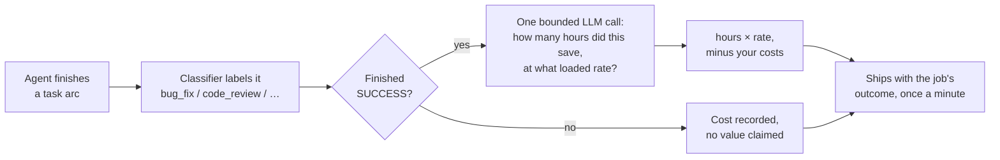

# Job value: a practical overview

[← Documentation index](README.md) · [Full reference →](value-and-roi.md)

> **Experimental, opt-in, off by default.** An install that leaves it off meters exactly as
> it does today.

This short version helps an operator decide whether to turn the feature on. It explains
the mechanism, defines the number's limits, and provides an annotated configuration for a
software engineering team.

[Job value and ROI](value-and-roi.md) is the full reference for every field, failure mode,
the wire format, and troubleshooting. Start here and use the full reference when needed.

---

## The problem

Your agent spend shows up as tokens and dollars. That tells you what you spent. It says
nothing about what you got.

This feature adds an estimate of what each completed task arc was *worth* to the record that
already carries its cost. A Revenium dashboard can then show value and cost side by side.

## How it works

The existing plugin and cron perform five steps. The feature adds no background service.



1. **The agent finishes a task arc.** A coherent piece of work with a goal — fix the bug,
   review the PR — not a single turn.
2. **The classifier labels it.** This already happens today; it is what puts `--task-type`
   on your metered rows.
3. **Only successful arcs are valued.** A failed or abandoned arc keeps its cost and gets no
   value. Nothing infers success from a transcript that merely sounds productive.
4. **One extra LLM call, on your own provider, estimates two assumptions** — hours of human
   work avoided, and the loaded hourly rate of the person who would have done it. The model
   is never asked for a dollar figure; it is asked for the inputs, and the skill multiplies
   them. A total the model volunteers anyway is discarded.
5. **Your own costs are subtracted, and the result ships** with the job's outcome on the next
   cron tick.

Two design choices explain most of the observed behaviour:

**The model can decline.** Abstaining is an expected answer, not a failure. When the work is
trivial or unclear, the evaluator returns nothing and the job reports its outcome with no
value attached. An evaluator that never declines would be indistinguishable from one that
always inflates.

**The skill never divides.** It sends a value, the costs it was netted against, and a list of
which costs were and were not included. Revenium already holds the metered AI cost for that
job and computes the ratio on its side.

## What the number means

Explain this distinction to anyone who sees the dashboard.

| | |
|---|---|
| **It is** | An **unverified model estimate**, derived from two capped assumptions, recorded alongside those assumptions so anyone can see what produced it. |
| **It is not** | A measurement, an observed outcome, or a customer-confirmed one. Nothing downstream is watched to confirm the claimed benefit occurred. |
| **On the wire** | The **low** end of the estimated range, not the midpoint. It understates by design. |
| **Labelled** | Every record carries `evidence_class: MODEL_ESTIMATED_DEMO`, so an estimate stays distinguishable from a measurement after the fact. |

`revenium jobs roi` does **not** display the evidence label. An estimate appears there with
the same weight as a measured figure. Readers need separate notice that the number is an
estimate because the product does not provide it.

## The configuration

One block in `~/.hermes/state/revenium/config.json`. The amounts below are illustrative
operator assumptions for a software engineering team. They are not product defaults,
measurements, or values produced by the evaluator. Each amount is a flat cost in the
configured currency, applied once to a completed job arc of that type.

```json
{
  "llmOutcomeEvaluation": {
    "enabled": true,
    "experimentalReportEstimates": true,
    "evaluator": "llm",
    "currency": "USD",
    "maxHoursSaved": 16,
    "maxLoadedRate": 220,
    "costs": {
      "bug_fix":             { "human_review": 45, "integration": 0 },
      "code_review":         { "human_review": 20 },
      "feature_development": { "human_review": 90, "integration": 120 },
      "refactoring":         { "human_review": 60, "rework_or_error": 40 },
      "debugging":           { "human_review": 45 },
      "testing":             { "human_review": 30, "integration": 0 },
      "devops":              { "human_review": 75, "rework_or_error": 60 },
      "documentation":       { "human_review": 25 },
      "research":            { "human_review": 15 },
      "planning":            { "human_review": 40 }
    }
  }
}
```

JSON does not support comments, so the annotations follow the example.

### The switches

| Key | Value | Why |
|---|---|---|
| `enabled` | `true` | Turns evaluation on. Must be a **literal boolean** — `"true"` as a string, or `1`, leaves it off with no warning. Same for the key below. |
| `experimentalReportEstimates` | `true` | Sends the number to Revenium. Set it to `false` (or omit it) to compute and store estimates locally while withholding the figure from the wire — see [Rolling it out](#rolling-it-out). |
| `evaluator` | `"llm"` | The default. Named explicitly here so the file documents itself. |
| `currency` | `"USD"` | Must match what the evaluator returns, or the assessment is rejected. Supported: `USD`, `EUR`, `GBP`, `CAD`, `AUD`, `JPY`, `CHF`. |

### The two ceilings

These bound the model's **inputs**, not the product. An assumption outside the range makes
the evaluator abstain and record the reason instead of quietly clamping the value.

| Key | Value | Why this number |
|---|---|---|
| `maxHoursSaved` | `16` | Two working days. The shipped default is `40`, which is a full week — far more than any single agent arc plausibly replaces. A tighter ceiling means an inflated estimate abstains loudly instead of landing as a large, wrong number. Start here and only raise it if you see legitimate arcs abstaining. |
| `maxLoadedRate` | `220` | A loaded senior-engineer hour: salary plus benefits, taxes, and overhead — not the base hourly wage, which would understate by roughly a third. Use your own finance team's loaded-cost figure if you have one. The shipped default is `500`, deliberately permissive. |

Together they cap any single arc at `16 × 220 = $3,520`. Nothing can exceed that, whatever
the transcript says or the model returns.

### The costs

`costs` holds the organization's own cost assumptions for accepting an agent's output.
The skill defines the category names; the operator supplies the amounts. The classifier
does not derive them from the transcript, evaluator response, metered AI usage, or a
Revenium API. `estimated_value` stays the gross figure; `net_value` is the figure after
the configured costs for that job type are subtracted.

Four categories exist, and the keys are fixed:

| Category | What it means for an engineering team |
|---|---|
| `human_review` | Someone reads the diff before it lands. Almost always non-zero. |
| `rework_or_error` | What it costs when the agent gets it wrong and a person fixes it. |
| `integration` | Landing the change — migrations, coordination, staged rollout. |
| `training_or_change` | Bringing the team up to speed on a new pattern or tool. |

Three rules decide what actually happens:

- **Keyed by job type, with no default.** A job type absent from `costs` nets nothing. There
  is no fleet-wide bucket, which is why every type your team actually produces is listed
  above.
- **A supplied `0` and an omitted key are different, and both are deliberate.** `0` means
  "we checked, this costs nothing" and participates in the arithmetic as a known zero. An
  omitted key means "we do not know", is recorded as unknown, and stays out of the
  subtraction. `bug_fix` above says integration is genuinely free; `code_review` says nothing
  about integration at all.
- **Malformed values fail to unknown, never to zero.** A typo will not quietly corrupt the
  subtraction.

Reasoning behind the figures above, at a $220 loaded hour:

| Job type | Cost | Reasoning |
|---|---|---|
| `bug_fix` | review 45, integration **0** | ~12 min of review. A one-line fix ships on the existing pipeline, so integration is a true zero, not an unknown. |
| `code_review` | review 20 | The agent's review is a first pass; a person still skims it. Nothing to integrate. |
| `feature_development` | review 90, integration 120 | ~25 min of review, plus coordination to land the change. |
| `refactoring` | review 60, rework 40 | Behaviour-preserving changes need careful review, and this is where "looks right, subtly isn't" lives. |
| `debugging` | review 45 | Priced like `bug_fix` review; the diagnosis still needs confirming. |
| `testing` | review 30, integration **0** | New tests join the existing suite for free. |
| `devops` | review 75, rework 60 | Highest rework figure on the list. Infrastructure mistakes are expensive to discover late. |
| `documentation` | review 25 | Cheap to review, cheap to correct. |
| `research` | review 15 | You are reading the output anyway; that reading *is* the review. |
| `planning` | review 40 | A plan gets discussed before it is acted on. |

These amounts are static allocations, not observed expenses. Every successful evaluated
arc of a configured job type receives the same costs. If actual review or integration work
varies materially, use a defensible average and revisit it periodically. For occasional
rework, use an expected cost across comparable jobs rather than the worst possible failure.

#### Financial-services example

A regulated financial-services engineering team may incur more review and release cost than
the general example. Assume a loaded rate of `$240` per hour and a delivery process that
requires peer review, a control review, change evidence, and a staged production rollout:

```json
"costs": {
  "bug_fix": {
    "human_review": 120,
    "integration": 240
  },
  "feature_development": {
    "human_review": 240,
    "integration": 480,
    "training_or_change": 120
  },
  "devops": {
    "human_review": 240,
    "rework_or_error": 360,
    "integration": 480
  },
  "documentation": {
    "human_review": 120,
    "integration": 0
  }
}
```

Here, `human_review: 120` represents 30 minutes at the loaded rate. For a `bug_fix`,
`integration: 240` reserves one hour for the change ticket, control evidence, release
coordination, and rollout. The `documentation` entry uses `integration: 0` to state that
approved documentation has no separate deployment cost. Omitting that key would mean the
integration cost is unknown, not zero. These figures are examples; a financial institution
should derive its own amounts from its review and change-management process.

`interrupted` is absent because it is the terminal type for an arc cut short by a budget
halt or a pivot. It is never `SUCCESS` and therefore never valued, so a `costs` entry would
be dead configuration.

**Use defensible estimates.** These are operator-supplied numbers; the skill invents no cost
of its own. An approximate review-time estimate is better than an unconfigured job type that
silently nets nothing.

## What it looks like end to end

One `bug_fix` arc, all the way through.

**The agent** fixes a null-pointer regression in the payment flow, runs the test suite green,
and the classifier records the arc as `bug_fix`, `SUCCESS`.

**The evaluator** returns assumptions, not money:

```json
{ "economic_mechanism": "labor_substitution",
  "inferred_role": "backend engineer",
  "estimated_hours_saved": 1.5,
  "assumed_loaded_rate": 220.0,
  "currency": "USD",
  "basis": "repro and fix cycle on a payment-flow regression",
  "confidence": 0.7 }
```

Both assumptions are inside the ceilings, so the assessment is accepted.

**The arithmetic:**

| | |
|---|---|
| Gross estimate — 1.5 × 220 | `$330.00` |
| Range — ±15 % around it | `$280.50` … `$379.50` |
| Your `bug_fix` costs — 45 + 0 | `−$45.00` |
| **`net_value`** | **`$285.00`** |
| **Ships as `--outcome-value`** | **`$280.50`** — the low bound, not the midpoint |

**On the wire,** alongside the job's outcome:

```json
{"value_low":280.5,"value_base":330.0,"value_high":379.5,"bounds_source":"derived",
 "evidence_class":"MODEL_ESTIMATED_DEMO","reportability_status":"reportable",
 "economic_mechanism":"labor_substitution","net_value":285.0,
 "supplied_costs":{"human_review":45.0,"integration":0.0},
 "cost_coverage":{"included":["human_review","integration"],"known_zero":["integration"],
                  "unknown":["rework_or_error","training_or_change"],
                  "excluded":["metered_ai_cost"]},
 "evaluator":"llm","confidence":0.7,
 "assumptions":{"estimated_hours_saved":1.5,"assumed_loaded_rate":220.0}}
```

The `cost_coverage` block says that two categories were counted, one was a real zero, two were
never configured, and metered AI cost was omitted because Revenium already has it. The block
makes the partial subtraction explicit.

**On the Revenium side,** that `$280.50` meets the job's metered AI cost — cents, for an arc
like this — and the displayed ratio follows. It is an estimated ROI under stated assumptions,
and the assumptions rode along in the same payload.

## Rolling it out

Use all three stages in order.

**1 — Local only.** Set `enabled: true` and leave `experimentalReportEstimates` off. Estimates
are computed and written to disk; no figure reaches Revenium. Let it run for a week, then read
the records:

```bash
# how many jobs have an assessment
ls ~/.hermes/state/revenium/job-assessments/ | wc -l

# the current effective record for each — last line wins, one file at a time
for f in ~/.hermes/state/revenium/job-assessments/*.jsonl; do
  tail -1 "$f" | python3 -m json.tool
done
```

Process one file at a time because `tail -1` over a glob interleaves `==>` filename headers
and passes several documents to a parser that reads one.

Check whether the values are plausible and whether the evaluator declines trivial work. An
evaluator that prices *everything* is misconfigured or overestimating.

**2 — Tune.** Adjust `maxLoadedRate` to your real loaded cost, tighten `maxHoursSaved` if
estimates run long, and fill in `costs` for the job types you actually see. Check which
you're getting:

```bash
cat ~/.hermes/state/revenium/job-taxonomy.json | python3 -c "import json,sys;print(*json.load(sys.stdin)['labels'],sep='\n')"
```

**3 — Report.** Set `experimentalReportEstimates: true`. Values now reach Revenium.

Verify the switch took at any stage:

```bash
bash ~/.hermes/skills/revenium/scripts/diagnose.sh
```

Section 9 prints `enabled=` and `evaluator=` per profile. On a multi-profile host, check the
profile you meant to configure — editing the wrong one is the most common way this silently
does nothing.

## Two things people get wrong

**Nesting `boundaries` inside `llmOutcomeEvaluation`.** The advanced `boundaries` block is a
**top-level** key of `config.json`, a sibling of `llmOutcomeEvaluation`, not a member of it.
Misplace it and it resolves to nothing, silently, with everything falling back to the
built-in implementations. Most teams never need this block at all.

**Assuming a stale plugin is a current one.** Value estimation runs inside the classifier
plugin, and on a multi-profile host plugins are installed **per profile**. "Installed"
does not imply "current". Run `plugin-status.sh` after any upgrade.

## Where to go next

| | |
|---|---|
| Every field, failure mode, and the wire format | [Job value and ROI](value-and-roi.md) |
| Why an estimate is a hypothesis, and the vocabulary to use | [Claim distinctions and evidence boundaries](claim-distinctions-and-evidence-boundaries.md) |
| The complete `config.json` schema | [`references/config-schema.md`](../skills/revenium/references/config-schema.md) |
| What counts as one task arc | [`references/job-declaration.md`](../skills/revenium/references/job-declaration.md) |
